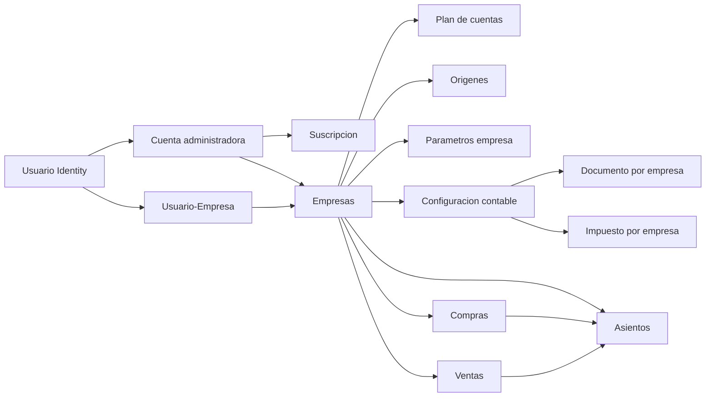

# DOCUMENTACION BD Y FUNCIONALIDADES - SisAdm

Ultima actualizacion: 25/07/2026
Proyecto: `SistemaAdministrativoWeb`  
Base de datos: `Dbsisadm`  
Arquitectura definida: ASP.NET Core MVC + ASP.NET Identity + ADO.NET + Stored Procedures + SQL Server

## 1. Objetivo del sistema

SisAdm es un sistema web administrativo contable multiempresa orientado a contadores o administradores que gestionan una o varias empresas desde una misma cuenta de usuario.

El objetivo inicial del sistema es reemplazar y modernizar los conceptos principales del sistema VB6 anterior, priorizando:

- Registro de provisiones de compras.
- Registro de provisiones de ventas.
- Registro de asientos contables manuales y automaticos.
- Mantenimientos base contables.
- Configuracion contable por empresa.
- Seguridad, suscripcion y control de usuarios administradores.

El sistema no maneja una empresa por usuario como restriccion fija. El modelo correcto es:

- Un usuario puede pertenecer a una cuenta administradora.
- Una cuenta administradora puede tener una suscripcion.
- Una cuenta administradora puede administrar varias empresas.
- Un usuario puede operar una o varias empresas segun la tabla de relacion.
- Cada empresa mantiene sus propios parametros, plan contable, origenes, reglas y registros operativos.

Ejemplo conceptual:

- `llara@gmail.com` puede operar empresas 1, 2 y 3.
- `loka@gmail.com` puede operar empresas 4, 5 y 6.

## 2. Tecnologias principales

- Framework: ASP.NET Core MVC.
- Target framework: `.NET 10.0`.
- Autenticacion base: ASP.NET Identity.
- Base de datos Identity: integrada en `ApplicationDbContext`.
- Base de datos de negocio: SQL Server, base `Dbsisadm`.
- Acceso a datos de negocio: ADO.NET con `Microsoft.Data.SqlClient`.
- Contrato de acceso a datos: repositorios por modulo.
- Persistencia de negocio: Stored Procedures.
- UI: Razor Views, Bootstrap, Bootstrap Icons, CSS propio en `wwwroot/css/site.css`.
- Sesion: ASP.NET Core Session para empresa activa.
- Autenticacion externa: Google, configurable por secrets.
- Captcha: Cloudflare Turnstile, configurable por secrets.

## 3. Rutas principales del proyecto

- Proyecto web: `C:\Users\Franco Lara\Desktop\GitHub Proyectos\Proyectos\.NET2026\SistemaAdministrativoWeb`
- Scripts de base de datos: `C:\Users\Franco Lara\Desktop\GitHub Proyectos\Proyectos\Basededatos\Dbsisadm`
- Tablas: `C:\Users\Franco Lara\Desktop\GitHub Proyectos\Proyectos\Basededatos\Dbsisadm\Tablas`
- Stored Procedures: `C:\Users\Franco Lara\Desktop\GitHub Proyectos\Proyectos\Basededatos\Dbsisadm\StoreProcedure`
- Scripts incrementales: `C:\Users\Franco Lara\Desktop\GitHub Proyectos\Proyectos\Basededatos\Dbsisadm\Script`

## 4. Configuracion y secrets

El proyecto carga configuracion sensible desde User Secrets en desarrollo.

Ruta esperada de secrets:

`C:\Users\Franco Lara\AppData\Roaming\Microsoft\UserSecrets\aspnet-SistemaAdministrativoWeb-53c45fe8-ede4-4ae5-9d55-e176dba84e4e\secrets.json`

Tambien intenta cargar:

`C:\Users\Franco Lara\AppData\Roaming\Microsoft\UserSecrets\aspnet-SistemaAdministrativoWeb-53c45fe8-ede4-4ae5-9d55-e176dba84e4e\secretsLocal.json`

Claves principales:

- `ConnectionStrings:DefaultConnection`: cadena SQL Server hacia `Dbsisadm`.
- `Authentication:Google:ClientId`: cliente OAuth Google.
- `Authentication:Google:ClientSecret`: secreto OAuth Google.
- `CloudflareTurnstile:SiteKey`: clave publica Turnstile.
- `CloudflareTurnstile:SecretKey`: clave privada Turnstile.
- `IdentityBehavior:RequireConfirmedAccount`: obliga o no confirmacion de cuenta.
- `IdentityBehavior:AutoConfirmEmail`: permite autoconfirmar correo en desarrollo.
- `IdentitySeed:SuperAdminEmails`: correos que deben recibir rol de superadmin.
- `MigoApi:BaseUrl`: URL base de la API de Migo para tipos de cambio, padron por RUC/DNI y validacion CPE.
- `MigoApi:Token`: token privado de autenticacion emitido por Migo.

## 5. Cambios recientes relevantes

- `25/07/2026`: se implementa validacion central de vigencia de suscripcion en ASP.NET Core. Las cuentas en prueba se bloquean al superar `FechaFinPrueba`; los planes pagados conservan acceso hasta `FechaFinGracia` o, en su defecto, hasta `FechaFinPlan + DiasGracia`; los estados `SUSPENDIDO` y `BAJA` se restringen inmediatamente. `SuperAdmin` queda exceptuado y, durante la restriccion, solo permanecen disponibles `Mi suscripcion`, `Ayuda`, renovacion/pago, seguridad de contrasena temporal y cierre de sesion. `usp_SEG_ObtenerContextoLoginUsuario` devuelve el contexto comercial necesario. `usp_SEG_SincronizarVencimientoSuscripcionCuentaAdministradora` persiste como suspendida e inactiva la suscripcion efectivamente vencida al evaluar el acceso y registra su movimiento historico. El panel SuperAdmin resume y pliega el detalle de cada cuenta; su consulta paginada clasifica tambien vencimientos aun no sincronizados. Al iniciar contrato se elige visualmente Emprendedor o Contador, conservando los codigos internos `BASICO` y `PRO`, y se aplican sus limites vigentes de 3 empresas/2 usuarios o 10 empresas/3 usuarios. La prueba se inicializa con 1 empresa/1 usuario. Los limites efectivos permanecen editables por cuenta desde SuperAdmin y `usp_SEG_RegistrarEmpresaCuentaAdministradora` y `usp_SEG_AsignarUsuarioCuentaAdministradora` los validan transaccionalmente antes de nuevas altas o reactivaciones. La caracteristica `CpeValidation` se resuelve centralmente sin tablas adicionales: solo `PRO`/Contador y `SuperAdmin` pueden ejecutar la validacion CPE; Prueba y Emprendedor conservan el resto del panel.

- `30/06/2026`: se agrega el grupo de menu `Proceso` con la pantalla `Cerrar Periodo`. El cierre se almacena por empresa y periodo en `CON_PeriodoContableEstado`, se consulta con `usp_CON_ObtenerPeriodoContableEstado` y se persiste con `usp_CON_GuardarPeriodoContableEstado`. Cuando un periodo queda cerrado se bloquean compras, ventas, caja y bancos, transferencias y aplicaciones; los asientos manuales continúan habilitados.
- `02/07/2026`: `Registro > Asientos` amplía su manejo a 16 periodos contables (`00`, `01-12`, `13-15`). El formulario precarga fechas fisicas de apertura/cierre y el guardado manual usa `Periodo` logico para correlativo, consulta y edicion en `CON_Asiento` y `CON_CorrelativoAsiento`.
- `02/07/2026`: se habilita `Proceso > Ajuste de Cuentas`, con origen configurable desde `Configuracion contable` bajo el modulo `AJU`, parametros `CUENTAGANANCIA_AJ` y `CUENTAPERDIDA_AJ`, proceso unico por periodo y generacion de asientos separados por cuenta analitica.
- `02/07/2026`: en `Ajuste de Cuentas`, el agrupamiento documental replica el legado usando `CON_AsientoDetalle.NumeroDocumento` como auxiliar/RUC-DNI y `TipoDocumento + Serie + ReferenciaLinea` como identificacion del comprobante, evitando tratar el auxiliar como numero de comprobante.
- `02/07/2026`: `Diferencia en Cambio` y `Ajuste de Cuentas` limpian sus tablas variables en cada iteracion por cuenta para evitar que un analisis o comprobante arrastre lineas hacia la siguiente cuenta procesada. En `AJU`, cada asiento ahora se genera en la moneda natural de la cuenta (`PEN`/`USD`) sin perder `TotalImporteS` y `TotalImporteD` en el detalle.
- `02/07/2026`: `CON_PlanCuentaMaestro` incorpora `GeneraDiferenciaPorAnalisis` y el alta de empresas ahora carga plan de cuentas automatico; la empresa principal parte del maestro y la empresa adicional puede heredar el `CON_PlanCuenta` de una empresa base.
- `02/07/2026`: se habilita `Proceso > Asiento de apertura`, con origen configurable desde `Configuracion contable` bajo el modulo `APR`, proceso anual por ejercicio, corte configurable sobre los 16 periodos contables del ejercicio base y generacion de un unico asiento en el periodo especial `00`.
- `02/07/2026`: se habilita `Proceso > Asiento de cierre`, con origen configurable desde `Configuracion contable` bajo el modulo `CIE`, proceso anual por ejercicio y generacion de asientos por cuenta para los periodos especiales `14` y `15`.
- `02/07/2026`: las pantallas `Proceso > Diferencia en Cambio`, `Ajuste de Cuentas`, `Asiento de apertura` y `Asiento de cierre` agregan una accion de eliminacion exclusiva para borrar solo la generacion automatica del periodo o ejercicio consultado, sin relanzar el proceso.
- `02/07/2026`: los listados operativos y de mantenimiento con filtros por `anio/mes` consultan automaticamente al cambiar el periodo, muestran overlay global de carga en consultar/guardar/procesar y convierten el numero de asiento en enlace al detalle cuando existe asiento relacionado.
- `02/07/2026`: el modulo `Registro > Asientos` oculta la eliminacion de asientos automaticos, marca visualmente esos registros y bloquea el boton `Guardar asiento` cuando el asiento proviene de compras, ventas, caja y bancos o procesos automaticos.
- `06/07/2026`: `CON_AsientoDetalle` amplia `CK_CON_AsientoDetalle_Montos` para aceptar lineas analiticas de ajuste cambiario con `Debe = 0` y `Haber = 0` siempre que la diferencia quede registrada en `TotalImporteS` y/o `TotalImporteD`. Esto habilita pagos cruzados y cancelaciones al `100 %` desde `Caja y Bancos` sin romper la consistencia del detalle contable.
- `06/07/2026`: se habilita `Reportes > Analisis de cuentas` como reporte HTML sin Crystal. El nuevo `usp_CON_ReporteAnalisisCuentas` replica la salida legacy por cuenta, documento o auxiliar usando `CON_Asiento`, `CON_AsientoDetalle` y `CON_PlanCuenta` sobre cuentas marcadas para analisis documental.
- `06/07/2026`: se habilitan `Reportes > Libro Diario` y `Reportes > Libro Mayor` como reportes HTML. `Libro Diario` cubre diario auxiliar y diario por origen en modo detallado o resumido; `Libro Mayor` replica el mayor por cuenta usando `NumeroDocumento` como equivalente funcional del auxiliar legacy.
- `07/07/2026`: se habilita `Reportes > Balance de comprobacion` como reporte HTML. El nuevo `usp_CON_ReporteBalanceComprobacion` replica `FrmBalanceComprobacion` del legacy con rango de periodos `00-15`, moneda, grado, filtro de grado exacto y rango opcional de cuentas, consolidando por jerarquia de `CON_PlanCuenta`.
- `07/07/2026`: los reportes HTML `Balance de comprobacion`, `Analisis de cuentas`, `Libro Diario` y `Libro Mayor` adoptan una presentacion compacta tipo hoja A4 inspirada en los Crystal legacy y agregan impresion directa desde pantalla con barra de acciones oculta al imprimir. Esta forma visual queda como estandar para futuras solicitudes de reportes contables HTML.
- `07/07/2026`: se habilitan `Reportes > Registro de ventas` y `Reportes > Registro de compras` como reportes HTML tipo A4 basados en `VEN_Venta` y `COM_Compra`, con filtro por anio, periodo y codigo de persona opcional, sin depender de `CON_AsientoDetalle`.
- `08/07/2026`: `Libro Diario` fija la moneda base del reporte en `PEN`, retira los filtros visibles de moneda y origen, y redefine sus vistas como `Diario auxiliar`, `Por Cuenta` y `Por Origen`. El `usp_CON_ReporteLibroDiario` ahora totaliza `Por Cuenta` por `CodigoCuenta` y `Por Origen` por `CodigoOrigen`, manteniendo visibles las columnas `Debe/Haber` en soles y `Debe/Haber USD`.
- `08/07/2026`: `Libro Mayor` cambia a filtro por `anio + mes`, elimina la moneda editable y replica `rptMayorAuxiliarA4` segmentando por cuenta contable. El `usp_CON_ReporteLibroMayor` ahora filtra por `CON_Asiento.Periodo`, calcula saldo anterior solo con periodos menores del mismo anio, usa siempre `TotalImporteS` como base en soles, expone `Debe/Haber USD` separados y deja el saldo final unicamente al cierre de cada cuenta.
- `11/07/2026`: `Registro > Asientos` trata siempre como automaticos los asientos con origen `ING` y `EGR` generados desde `Caja y Bancos`, ocultando su eliminacion directa y bloqueando su edicion manual para que solo se mantengan desde el modulo bancario de origen.
- `11/07/2026`: `Reportes > Analisis de cuentas` corrige su calculo multimoneda para que el filtro `USD` y las columnas dolarizadas del procedimiento `usp_CON_ReporteAnalisisCuentas` usen siempre `CON_AsientoDetalle.TotalImporteD` por linea, sin depender de la moneda fija configurada en la cuenta contable.
- `11/07/2026`: se habilita `Voucher contable` como reporte HTML A4 inspirado en `rptVoucherContableA4`, consultando el asiento y su detalle desde `IAsientoRepository.ObtenerAsync`, con impresion directa, encabezado por empresa/RUC y acceso desde el formulario del asiento.
- `10/07/2026`: inicia la base tecnica de seguridad por opcion para cuentas administradoras. Se agregan catalogos de modulos y roles (`SEG_ModuloSistema`, `SEG_RolCuenta`), permisos base por rol (`SEG_RolCuentaPermiso`), overrides por usuario a nivel cuenta y empresa (`SEG_UsuarioCuentaPermiso`, `SEG_UsuarioEmpresaPermiso`) y nuevos SP para siembra y contexto de login (`usp_SEG_SeedSeguridadCuentaPermisosBase`, `usp_SEG_ObtenerContextoLoginUsuario`).
- `01/07/2026`: se habilita `Proceso > Diferencia en Cambio`, con origen configurable desde `Configuracion contable`, un proceso por periodo y generacion de asientos separados por cuenta en dolares.
- `30/06/2026`: la importacion XML de compras (`usp_COM_ImportarCompraXml`) valida duplicados por `IdEmpresa + IdProveedor + TipoComprobante + Serie + Numero`. Cuando detecta un duplicado ahora informa tambien `IdCompra`, `FechaEmision` y `Estado` del comprobante existente para facilitar la identificacion de registros `EN REVISION` importados previamente en otro periodo visible.
- `MigoApi:ExchangeDatePath`: path relativo para consultar tipo de cambio por fecha.
- `MigoApi:ExchangeRangePath`: path relativo para consultar tipos de cambio por rango de fechas.
- `MigoApi:RucPath`: path relativo para consultar RUC en Migo.
- `MigoApi:DniPath`: path relativo para consultar DNI en Migo.
- `MigoApi:CpePath`: path relativo para validar comprobantes electronicos en Migo.
- `RutasLocales:BaseDatosRootPath`: ruta raiz SQL del proyecto.
- `RutasLocales:SqlTablasPath`: ruta de tablas.
- `RutasLocales:SqlStoreProcedurePath`: ruta de procedimientos.
- `RutasLocales:SqlScriptPath`: ruta de scripts incrementales.

Archivo ejemplo disponible:

- `appsettings.Secrets.example.json`

## 5. Flujo de arranque ASP.NET Core

El arranque se define en `Program.cs`.

Orden principal:

1. Carga de configuracion y secrets en desarrollo.
2. Lectura de `ConnectionStrings:DefaultConnection`.
3. Registro de `ApplicationDbContext` para Identity.
4. Configuracion de Identity con roles.
5. Configuracion opcional de Google.
6. Registro de MVC.
7. Registro de sesion.
8. Registro de repositorios ADO.NET.
9. Registro de servicios de seguridad y Turnstile.
10. Seed inicial de roles y usuarios superadmin.
11. Pipeline HTTP: HTTPS, routing, session, authentication, authorization.
12. Rutas MVC, areas y Razor Pages.

## 6. Identidad y seguridad

Identity usa las tablas estandar de ASP.NET Identity generadas por migraciones EF Core.

Modelo actual:

- `ApplicationDbContext` hereda de `IdentityDbContext<IdentityUser, IdentityRole, string>`.
- Se usan roles mediante `AddRoles<IdentityRole>()`.
- Se registran usuarios desde `Areas/Identity/Pages/Account/Register`.
- Login local y login externo Google desde `Areas/Identity/Pages/Account/Login`.
- Se usa Cloudflare Turnstile en registro y login cuando esta configurado.
- La politica de clave exige longitud minima 6, digito, minuscula, mayuscula y caracter especial.
- `IdentityStartupSeeder` crea roles y asigna superadmin segun `IdentitySeed:SuperAdminEmails`.

## 7. Modelo multiempresa

La empresa activa se guarda en sesion mediante `SessionCurrentCompanyAccessor`.

Componentes:

- `ICurrentCompanyAccessor`: contrato para leer el contexto de empresa activa.
- `SessionCurrentCompanyAccessor`: implementacion basada en session.
- `EmpresaContextoController`: seleccion y registro de empresas.
- `SEG_UsuarioEmpresa`: relacion usuario-empresa.
- `SEG_CuentaAdministradora`: cuenta administradora propietaria de la suscripcion.
- `SEG_UsuarioCuentaAdministradora`: relacion usuario-cuenta administradora.
- `SEG_Empresa`: empresas disponibles.

Reglas funcionales:

- Si el usuario no tiene empresa asignada debe abrir el registro de empresa inicial.
- El usuario puede registrar otra empresa desde la seleccion de empresa.
- La empresa activa condiciona todos los mantenimientos y registros contables.
- Los registros contables siempre deben persistirse con `IdEmpresa`.

## 8. Estructura visual y navegacion

Layout principal:

- `Views/Shared/_Layout.cshtml`

Tipos de shell:

- Publico: login, registro e inicio.
- Administrador: panel contable multiempresa.
- Plataforma: panel superadmin para suscriptores.

Menu administrador:

- General: Dashboard, Empresas.
- Mantenimiento: Plan de cuentas, Centros de costo, Cuentas corrientes, Personas, Origenes, Cuentas destino, Configuracion contable.
- Proceso: Diferencia en Cambio, Ajuste de Cuentas, Asiento de apertura, Asiento de cierre, Cerrar Periodo.
- Registro: Asientos, Compras, Ventas, Caja y Bancos, Transferencias, Aplicaciones.
- Reportes: Balance de comprobacion, Analisis de cuentas, Libro Diario, Libro Mayor.

El mantenimiento independiente de parametros fue retirado. La parametrizacion operativa debe gestionarse desde Configuracion contable.

## 9. Modulos funcionales

### 9.1 Inicio

Controlador:

- `HomeController`

Funciones:

- Redirige segun contexto de usuario y empresa.
- Muestra pantalla inicial publica.
- Maneja vista de privacidad y error.

### 9.2 Registro y login

Archivos:

- `Areas/Identity/Pages/Account/Register.cshtml`
- `Areas/Identity/Pages/Account/Register.cshtml.cs`
- `Areas/Identity/Pages/Account/Login.cshtml`
- `Areas/Identity/Pages/Account/Login.cshtml.cs`

Funciones:

- Registro solo de usuario.
- Login por correo y password.
- Login con Google.
- Validacion Turnstile.
- Mensajes de validacion para reglas de password.

### 9.3 Seleccion y registro de empresa

Controlador:

- `EmpresaContextoController`

Vistas:

- `Views/EmpresaContexto/Index.cshtml`
- `Views/EmpresaContexto/RegistrarEmpresaInicial.cshtml`

Funciones:

- Lista empresas vinculadas al usuario.
- Permite seleccionar empresa activa.
- Permite registrar empresa inicial o empresa adicional.
- Al registrar empresa se crea la relacion de usuario y se cargan parametros base.

### 9.4 Panel principal

Controlador:

- `PanelController`

Vista:

- `Views/Panel/Index.cshtml`

Funciones:

- Dashboard base por empresa activa.
- Entrada al menu operativo.

### 9.5 Panel superadmin de plataforma

Controlador:

- `PlataformaController`

Vista:

- `Views/Plataforma/Index.cshtml`

Funciones:

- Control de cuentas administradoras.
- Visualizacion de suscripciones.
- Alta, baja o actualizacion de datos de suscripcion.
- Gestion operativa de clientes/suscriptores de la plataforma.
- Inicio manual de contrato comercial por cuenta administradora.
- Registro de cobros manuales, por transferencia o conciliados desde pasarela.
- Historial comercial de cambios de suscripcion por cuenta.
- Historial de cobros con confirmacion y aplicacion sobre la suscripcion.
- La suscripcion en SisAdm se controla por `CuentaAdministradora`, no por empresa individual.
- La base actual soporta trazabilidad de pasarela mediante proveedor, ids externos, estado y payload, pero aun no ejecuta webhooks, reintentos ni renovacion automatica.

### 9.5.1 Reportes contables

Controlador:

- `ReporteController`

Vistas:

- `Views/Reporte/AnalisisCuentas.cshtml`
- `Views/Reporte/BalanceComprobacion.cshtml`
- `Views/Reporte/LibroDiario.cshtml`
- `Views/Reporte/LibroMayor.cshtml`
- `Views/Reporte/RegistroVentas.cshtml`
- `Views/Reporte/RegistroCompras.cshtml`
- `Views/Reporte/VoucherContable.cshtml`

Funciones:

- Habilita `Reportes > Analisis de cuentas`, `Libro Diario`, `Libro Mayor`, `Registro de ventas`, `Registro de compras` y `Balance de comprobacion` como reportes HTML del bloque contable.
- Habilita `Voucher contable` como salida HTML A4 del asiento contable, abierta desde el formulario de asientos mediante `ReporteController.VoucherContable`.
- Para futuras solicitudes de reportes contables HTML, la presentacion base debe seguir el formato compacto tipo hoja A4 del legacy: encabezado de reporte, bloque meta corto, tabla densa, pie de totales y barra de acciones en pantalla con impresion directa, evitando layouts de dashboard para la salida principal del reporte.
- `Balance de comprobacion` replica `FrmBalanceComprobacion`, manejando `anio`, `periodo desde`, `periodo hasta`, `moneda`, `grado`, `todas las cuentas`, `rango de cuentas` y `filtrar grado`.
- La salida muestra columnas de anterior, periodo final, acumulado del rango y distribucion por activo/pasivo, naturaleza y funcion, siguiendo `ColBalance`.
- Replica el comportamiento base del legacy `FrmRptAnalisisCta` sin depender de Crystal Reports.
- `Voucher contable` replica la salida del formulario `FrmRegistroComprobante` y el Crystal `rptVoucherContableA4`, mostrando cabecera del asiento, glosa, moneda, referencia y detalle por linea con importes en soles y, cuando exista data, referencia adicional en dolares.
- Permite consultar por `anio`, `mes`, `moneda`, `estado`, `tipo de vista`, rango de cuentas y `NumeroDocumento`.
- En esta migracion, el `CtaAuxiliar` del legacy se mapea a `CON_AsientoDetalle.NumeroDocumento`; la clave analitica/documental usa `NumeroDocumento + TipoDocumento + Serie + ReferenciaLinea`, igual que en diferencia en cambio.
- La vista `Detallado` devuelve movimientos linea por linea.
- La vista `Por documento` consolida por cuenta, auxiliar, tipo, serie y numero de referencia.
- La vista `Por auxiliar` consolida por cuenta y auxiliar.
- El filtro de pendientes o cancelados se calcula por saldo acumulado del analisis en la moneda seleccionada.
- `Libro Diario` replica `FrmRptDiarioAux` y `FrmRptDiarioPorOrigenGeneral`, ofreciendo `Diario auxiliar`, `Por Cuenta` y `Por Origen`.
- La consulta del diario usa siempre moneda base `PEN` hacia `usp_CON_ReporteLibroDiario`; las columnas en USD siguen visibles como referencia usando `TotalImporteD`.
- `Libro Mayor` replica el enfoque de `usp_MayorAuxiliar` y `rptMayorAuxiliarA4`, filtrando por `anio`, `mes`, rango de cuentas y `NumeroDocumento`.
- La salida del mayor se segmenta por cuenta contable, muestra saldo del mes anterior y detalla cada movimiento con `Debe/Haber` en soles y `Debe/Haber USD`; el saldo final se muestra solo al cierre de cada cuenta y no por cada linea.
- `Registro de ventas` replica el formato A4 de `rptRegVentasA4`, tomando la provision `VEN_Venta` y filtrando por `anio`, `periodo` y `CodigoCliente`.
- `Registro de compras` replica el formato A4 de `RptRegistroCompra_A4_Oxa`, tomando la provision `COM_Compra` y filtrando por `anio`, `periodo` y `CodigoProveedor`.

### 9.6 Plan de cuentas

Controlador:

- `PlanCuentaController`

Vistas:

- `Views/PlanCuenta/Index.cshtml`
- `Views/PlanCuenta/Formulario.cshtml`

Funciones:

- Listado paginado de cuentas contables por empresa.
- Filtro por texto y nivel.
- Registro y edicion de cuentas.
- Popup reutilizable para seleccionar cuenta padre.
- Permite configurar cuentas destino y contrapartida desde el mismo mantenimiento cuando la cuenta es operativa o de ultimo nivel.
- Carga default desde `CON_PlanCuentaMaestro` o desde `CON_PlanCuenta` de una empresa base cuando la nueva empresa se registra usando otra empresa como origen.
- Validacion de jerarquia por niveles usando parametros:
  `GRADO_MAXIMO`, `GRADO1_LONG`, `GRADO2_LONG`, `GRADO3_LONG`, `GRADO4_LONG`, `GRADO5_LONG`.
- El guardado del plan de cuentas toma esos parametros desde `ADM_ParametroEmpresa` usando `TipoParametro = 'NA'`, que es la convencion vigente para la estructura contable por empresa.
- En el mantenimiento web del plan contable, la moneda puede venir historicamente como `S/D`; la interfaz la normaliza y la persiste como `PEN/USD` para no romper los procesos nuevos que ya trabajan con esos codigos.

Campos relevantes:

- Codigo de cuenta.
- Cuenta padre.
- Nombre.
- Nivel.
- `ColBalance` con valores funcionales: Saldo, Inventario, Naturaleza, Funcion, Resultado.
- Moneda opcional.
- Tipo de cambio opcional.
- Acepta movimiento.
- Requiere centro de costo.
- Estado.

### 9.7 Personas

Controlador:

- `PersonaController`

Vistas:

- `Views/Persona/Index.cshtml`
- `Views/Persona/Formulario.cshtml`

Funciones:

- Listado paginado de personas por empresa.
- Filtro por texto, tipo persona, cliente y proveedor.
- Registro y edicion de persona.
- Ubigeo por departamento, provincia y distrito.
- Tipo de persona: Natural o Juridica.
- Tipo de documento desde `TiposDocumentoIdentidadSunat`.
- Boton `Consultar` en el formulario para consultar Migo por RUC o DNI antes de guardar.
- Con RUC, Migo devuelve razon social, direccion y ubigeo para poblar automaticamente el formulario.
- Con DNI, Migo devuelve el nombre completo y el sistema lo separa de forma heuristica en apellidos y nombres.
- Si se marca cliente, crea o actualiza `ADM_Cliente`.
- Si se marca proveedor, crea o actualiza `ADM_Proveedor`.
- Si no se marca cliente/proveedor, queda solo como persona.

### 9.8 Origenes contables

Controlador:

- `OrigenController`

Vistas:

- `Views/Origen/Index.cshtml`
- `Views/Origen/Formulario.cshtml`

Funciones:

- Listado paginado de origenes por empresa.
- Registro y edicion de origen contable.
- Carga default desde `CON_OrigenMaestro`.
- Uso posterior en asientos, compras, ventas y configuracion contable.

### 9.8.1 Centros de costo

Controlador:

- `CentroCostoController`

Vistas:

- `Views/CentroCosto/Index.cshtml`
- `Views/CentroCosto/Formulario.cshtml`

Funciones:

- Listado paginado de centros de costo por empresa.
- Registro y edicion sobre `CON_CentroCostoConfiguracionEmpresa`.
- Ayuda popup reutilizable para seleccionar centros de costo en el asiento manual.
- Validacion operativa: si la cuenta contable requiere centro de costo, la linea del asiento debe informarlo.

### 9.8.2 Cuentas corrientes

Controlador:

- `CuentaCorrienteController`

Vistas:

- `Views/CuentaCorriente/Index.cshtml`
- `Views/CuentaCorriente/Formulario.cshtml`

Funciones:

- Listado paginado de cuentas corrientes bancarias por empresa.
- Registro y edicion sobre `CON_BancosConfiguracionEmpresa`.
- Registro de titular y moneda operativa usando el mismo maestro `ADM_Moneda` de provisiones y asientos.
- Registro de `Periodo saldo inicial`, `Saldo inicial Debe` y `Saldo inicial Haber` para definir desde que mes empieza a operar la cuenta en Caja y Bancos.
- Ayuda popup de bancos basada en el catalogo maestro `CON_Bancos`.
- Ayuda popup de plan de cuentas para amarrar la cuenta corriente a una cuenta contable activa de movimiento.

### 9.9 Cuentas destino

Controlador:

- `CuentaDestinoReglaController`

Vistas:

- `Views/CuentaDestinoRegla/Index.cshtml`
- `Views/CuentaDestinoRegla/Formulario.cshtml`

Funciones:

- Define cuentas destino por empresa y cuenta contable origen.
- Permite configurar cuenta origen, destino y contrapartida sin filtro por ejercicio.
- La misma configuracion puede mantenerse tambien desde `PlanCuentaController` para cuentas de ultimo nivel.
- Hereda reglas base desde tablas maestras cuando corresponda.
- Base conceptual rescatada del VB6: cuentas que disparan cuentas destino contables.

### 9.10 Configuracion contable

Controlador:

- `ConfiguracionContabilizacionController`

Vista principal:

- `Views/ConfiguracionContabilizacion/Index.cshtml`

Parcial:

- `Views/ConfiguracionContabilizacion/_ImpuestoContableTab.cshtml`

Funciones actuales:

- Vista directa con tabs tipo tarjeta.
- Configura provisiones por tipo de operacion desde una sola tarjeta.
- Configura documentos por empresa.
- Configura impuestos por empresa.
- Centraliza parametros contables que antes estaban separados.

Tabs:

- Provision.
- Documento.
- Impuesto.
- Parametros.

Provision:

- Subtarjetas operativas para:
  `Compras`, `Ventas`, `Egresos`, `Ingresos`, `Aplicaciones`, `Diferencia en Cambio`, `Ajuste de Cuentas`, `Asiento de apertura` y `Asiento de cierre`.
- Cada subtarjeta guarda una fila en `CON_ConfiguracionContabilizacion` con escenario `PROVISION`.
- Origen contable seleccionado mediante popup.
- Genera asiento automatico.
- Configuracion activa.

Documento:

- Lee documentos desde `ADM_TipoComprobante`.
- Tiene subtabs Ventas y Compras.
- Por empresa se guardan cuentas contables para:
  `IdCuentaVentaSoles`, `IdCuentaVentaDolares`, `IdCuentaCompraSoles`, `IdCuentaCompraDolares`.
- La configuracion por empresa se guarda en `CON_DocumentoConfiguracionEmpresa`.

Impuesto:

- Lee impuestos desde `CON_TipoImpuesto`.
- La tabla maestra tambien puede tener cuenta base.
- La configuracion por empresa se guarda en `CON_TipoImpuestoConfiguracionEmpresa`.
- Actualmente se usa un solo campo `IdPlanCuenta`.
- La cuenta `SPOT` ya no se administra desde esta tarjeta.

Parametros:

- Lee parametros desde `ADM_ParametroEmpresa` para la empresa activa.
- Solo expone parametros cuyo `TipoParametro <> 'NA'`.
- Muestra `DescripcionParametro` y permite seleccionar una cuenta contable con la ayuda del plan.
- Guarda el codigo de cuenta seleccionado en `ValorParametro`.
- El parametro `CTADETRACCION` define la cuenta contable usada por el asiento adicional de detracciones en compras.

### 9.10.1 Tipos de cambio

Controlador:

- `TipoCambioController`

Vistas:

- `Views/TipoCambio/Index.cshtml`
- `Views/TipoCambio/Formulario.cshtml`

Funciones:

- Mantenimiento por `IdCuentaAdministradora`, no por empresa.
- Filtro operativo por periodo contable `yyyyMM`.
- Registro y edicion manual de tipos de cambio.
- Sincronizacion mensual desde el listado usando la API de Migo.
- Sincronizacion puntual por fecha desde el formulario usando la API de Migo.
- La integracion consulta el endpoint por fecha o rango, guarda o actualiza `CON_TipoCambio` y deja `Fuente = API`.
- Los registros de compras, ventas, asientos y Caja y Bancos consumen el mismo endpoint MVC para consultar por fecha; cuando la API devuelve el dato, el sistema lo persiste primero en `CON_TipoCambio` y luego lo refleja en el formulario.

### 9.11 Asientos contables

Controlador:

- `AsientoController`

Vistas:

- `Views/Asiento/Index.cshtml`
- `Views/Asiento/Formulario.cshtml`

Funciones:

- Listado paginado por empresa y periodo.
- Filtro por anio, mes y texto.
- Registro y edicion de asiento manual.
- Popup para cuenta contable.
- Popup para origen.
- Popup para centro de costo con seleccion por empresa activa.
- Detalle con glosa, centro de costo, RUC/DNI, tipo documento, serie, referencia, TC, debe y haber.
- El tipo de cambio de cabecera es obligatorio y cada linea del detalle exige un tipo de cambio mayor a cero, con boton visual de actualizacion junto al campo.
- El formulario muestra mes contable informativo y fecha de emision.
- La fecha de contabilizacion se fija automaticamente segun el periodo contable del registro.
- El modulo admite 16 periodos contables: `00 = Apertura`, `01-12 = Enero-Diciembre`, `13 = Ajustes y Liquidaciones`, `14 = Cierre de Ganancias y Pérdidas`, `15 = Cierre de Inventarios`.
- En asiento manual, la fecha visible por defecto es `01/01/<anio>` para el periodo `00`; para los periodos `13`, `14` y `15` la fecha por defecto es `31/12/<anio>`.
- El centro de costo es obligatorio solo cuando la cuenta seleccionada tiene activado `RequiereCentroCosto`.
- El resumen de Debe/Haber/Diferencia cambia visualmente segun el asiento este cuadrado o no.
- El asiento manual puede quedar descuadrado; el sistema ya no obliga el cuadre para guardar.
- El guardado deja el estado del asiento en `PROVISIONADO`.
- Si una cuenta del detalle tiene configuracion en `Cuentas destino`, la linea original se conserva y se agregan lineas adicionales de destino y contrapartida.
- El listado muestra el nombre del origen y agrega accion de eliminar.
- La eliminacion directa bloquea asientos automaticos y exige eliminarlos desde su modulo de origen.
- Correlativo por empresa, origen y periodo.

### 9.12 Compras

Controlador:

- `CompraController`

Vistas:

- `Views/Compra/Index.cshtml`
- `Views/Compra/Formulario.cshtml`

Funciones:

- Listado paginado por empresa y periodo.
- Filtro por anio, mes y texto.
- Registro y edicion de compras.
- Eliminacion de compras desde el listado.
- Filtro adicional por tipo de documento en el listado; los KPIs visibles se recalculan sobre la consulta filtrada.
- Boton `Carga masiva de compras` junto a `Registrar compra` para importar XML SUNAT.
- Boton `Validar CPE` solo para el plan Contador y para factura (`01`), boleta (`03`), recibo por honorarios (`02`), nota de credito (`07`) y nota de debito (`08`). La accion POST esta protegida por la politica de autorizacion `PlanFeature:CpeValidation`, independientemente de la visibilidad del boton.
- La validacion CPE guarda fecha, estado y mensaje devueltos por Migo para mostrar el resultado en el listado.
- Ayuda popup de proveedores.
- Creacion rapida de proveedor.
- Si se crea proveedor rapido se inserta persona y proveedor con ubigeo por defecto `150101`.
- Al seleccionar proveedor se autocompletan datos.
- Periodo contable visible en la parte superior del formulario solo como referencia del periodo elegido en el listado.
- Detalle con cuenta contable seleccionada por popup y tipo de afectacion IGV.
- Tipo de afectacion IGV por defecto: `10 - Gravado - Operacion Onerosa`.
- Totales globales calculados desde el detalle: subtotal, total exonerado, total inafecto, IGV e importe total.
- Los totales globales no son editables desde el formulario.
- La carga masiva de compras acepta `01`, `03`, `07`, `08` y `02` (recibo por honorarios), crea proveedores automaticamente cuando no existen y evita duplicados por proveedor + tipo + serie + numero.
- La compra importada desde XML se guarda en estado `EN REVISION`, sin `IdAsiento` y con la cuenta del detalle precargada desde el parametro de empresa `CTACOMPRADEFAULT`; el usuario aun debe entrar al comprobante y volver a grabar para generar el asiento o cambiar la cuenta si lo necesita.
- Guarda compra y genera asiento contable segun configuracion.

### 9.13 Ventas

Controlador:

- `VentaController`

Vistas:

- `Views/Venta/Index.cshtml`
- `Views/Venta/Formulario.cshtml`

Funciones:

- Listado paginado por empresa y periodo.
- Filtro por anio, mes y texto.
- Registro y edicion de ventas.
- Eliminacion de ventas desde el listado.
- Filtro adicional por tipo de documento en el listado; los KPIs visibles se recalculan sobre la consulta filtrada.
- Boton `Carga masiva de ventas` junto a `Registrar venta` para importar XML SUNAT.
- Ayuda popup de clientes.
- Creacion rapida de cliente.
- Si se crea cliente rapido se inserta persona y cliente con ubigeo por defecto `150101`.
- Al seleccionar cliente se autocompletan datos.
- Periodo contable visible en la parte superior del formulario solo como referencia del periodo elegido en el listado.
- La carga masiva de ventas acepta `01`, `03`, `07` y `08`, crea clientes automaticamente cuando no existen y evita duplicados por cliente + tipo + serie + numero.
- La venta importada desde XML se guarda en estado `EN REVISION`, sin `IdAsiento` y con la cuenta del detalle precargada desde el parametro de empresa `CTAVENTADEFAULT`; el usuario aun debe entrar al comprobante y volver a grabar para generar el asiento o cambiar la cuenta si lo necesita.
- Guarda venta y genera asiento contable segun configuracion.
- Permite previsualizar asiento desde la informacion ingresada.

### 9.14 Caja y Bancos

Controlador:

- `CajaBancoController`

Vistas:

- `Views/CajaBanco/Index.cshtml`
- `Views/CajaBanco/Formulario.cshtml`

Funciones:

- Listado paginado de movimientos bancarios por empresa.
- Filtro por cuenta corriente, anio, mes y texto.
- KPIs de saldo inicial, ingresos del mes, egresos del mes y saldo final.
- El KPI `Saldo inicial` suma el arrastre historico de movimientos mas el saldo inicial configurado en la cuenta corriente cuando su `Periodo saldo inicial` es menor o igual al periodo consultado.
- Registro y edicion de movimientos bancarios.
- Seleccion de tipo de flujo `Ingreso` o `Egreso`.
- Seleccion de operacion bancaria desde la tabla `operacionesbancarias` filtrando `Destino = 'I'` o `Destino = 'E'`.
- Seleccion de persona relacionada mediante popup.
- Cabecera del movimiento con `Nro movimiento`, `Fecha emision`, `Tipo de cambio`, `Nro de Operacion`, `Glosa`, `Observaciones` e `Importe total` editable para representar el total de la operacion.
- Detalle contable con cuenta, persona por linea, glosa, centro de costo, debe y haber.
- Popup reutilizable para ayuda de cuenta contable y centro de costo.
- Cada linea del detalle puede seleccionar una persona distinta para reutilizar la ayuda de comprobantes con saldo.
- El formulario muestra `Total Operacion`, `Total Detalle` y `Diferencia`, comparando el importe de cabecera contra el neto del detalle segun sea ingreso o egreso.
- Al guardar el movimiento bancario se genera y mantiene un asiento contable automatico con origen `ING` o `EGR` segun el tipo de flujo configurado en contabilidad.
- Si una cuenta del detalle tiene configuracion en `Cuentas destino`, el asiento conserva la linea original y agrega sus lineas de destino y contrapartida.
- La operacion bancaria elegida debe corresponder al destino `Ingreso` o `Egreso` configurado en `operacionesbancarias`.
- Cada movimiento de Caja y Bancos tiene un correlativo interno mensual independiente del `Nro documento`; reinicia en `1` por empresa y periodo de `FechaEmision`.
- Para guardar el detalle solo se exige `Cuenta`, `Glosa detalle` y un importe en `Debe` o `Haber`; persona, comprobante y centro de costo quedan opcionales.
- El guardado del movimiento bancario exige que la diferencia entre `Total Operacion` y `Total Detalle` sea exactamente cero.
- El listado de Caja y Bancos exige seleccionar una cuenta corriente antes de consultar y muestra el `NumeroAsiento` vinculado.
- Las ayudas popup de cuenta contable restringen la seleccion a cuentas del ultimo nivel.

### 9.15 Transferencias entre cuentas

Controlador:

- `TransferenciaCuentaController`

Vistas:

- `Views/TransferenciaCuenta/Index.cshtml`
- `Views/TransferenciaCuenta/Formulario.cshtml`

Funciones:

- Registra transferencias internas entre dos cuentas corrientes de la misma empresa sin crear tablas nuevas.
- Cada transferencia genera dos movimientos bancarios enlazados en `BAN_MovimientoBanco`: un `Egreso` para el emisor y un `Ingreso` para el receptor.
- Las operaciones bancarias del modulo se toman de `operacionesbancarias` filtrando `idTipoOpeBancaria = 'T'`, usando `Destino = 'E'` para el emisor y `Destino = 'I'` para el receptor.
- El bloque emisor captura `Fecha`, `Tipo de cambio`, `Nro operacion`, `Monto`, `Glosa` y `Observaciones`.
- El bloque receptor captura la misma informacion operativa, pero el `Monto` se calcula automaticamente segun la moneda de ambas cuentas y el `Tipo de cambio` queda bloqueado sincronizado desde el emisor.
- Si ambas cuentas tienen la misma moneda, el importe receptor es igual al emisor; si cambian entre `PEN` y `USD`, se multiplica o divide por el tipo de cambio.
- La `Glosa`, `Observaciones`, `Fecha` y `Nro operacion` del emisor se replican al receptor como valor inicial; el usuario puede ajustar el texto del receptor antes de guardar.
- En el detalle generado de la transferencia, la `GlosaDetalle` referencia la cuenta corriente contraria con el formato `Banco <NroCuentaCorriente>` y el `Nro operacion` se guarda en `ReferenciaLinea`, no en `RUC/DNI`.
- Cada movimiento generado crea y mantiene su asiento contable automatico reutilizando la logica de ingresos y egresos ya configurada, solo si la operacion bancaria correspondiente tiene `indTranConta = 'S'`.
- El listado del modulo une emisor y receptor a partir del enlace funcional guardado en `BAN_MovimientoBanco` y permite eliminar la transferencia completa.

### 9.16 Aplicaciones

### 9.17 Procesos

Controlador:

- `ProcesoController`

Vista:

- `Views/Proceso/CerrarPeriodo.cshtml`

Funciones actuales:

- Permite consultar el estado operativo de un periodo por `Año + Mes`.
- Permite cerrar el periodo cuando está abierto.
- Permite abrir nuevamente el periodo cuando ya estaba cerrado.
- Muestra el ultimo cambio realizado con fecha y usuario.
- El cierre afecta a Compras, Ventas, Caja y Bancos, Transferencias y Aplicaciones.
- Los asientos manuales no se bloquean por esta funcionalidad.

Objetos SQL asociados:

- Tabla `CON_PeriodoContableEstado`: guarda el estado `abierto/cerrado` por `IdEmpresa + Periodo`, junto con fechas y usuarios de cierre/apertura.
- `usp_CON_ObtenerPeriodoContableEstado`: devuelve el estado actual del periodo consultado.
- `usp_CON_GuardarPeriodoContableEstado`: inserta o actualiza el estado del periodo y registra fecha/usuario de cierre o reapertura.

Controlador:

- `AplicacionController`

Vistas:

- `Views/Aplicacion/Index.cshtml`
- `Views/Aplicacion/Formulario.cshtml`

Funciones:

- Registra aplicaciones entre un comprobante pendiente y una nota de credito del mismo cliente o proveedor.
- El tipo de trabajo se define como `Cliente` o `Proveedor`; internamente usa `VEN` para clientes y `COM` para proveedores.
- La ayuda operativa superior muestra comprobantes pendientes con saldo y la inferior muestra solo notas de credito (`TipoComprobante = '07'`) con saldo.
- Cada registro de aplicacion enlaza un solo comprobante con una sola nota de credito, permitiendo importes parciales.
- Si el importe aplicado no consume el saldo completo, el saldo restante permanece en el comprobante o en la nota de credito para aplicaciones futuras.
- El proceso genera asiento contable usando la provision `APNC` configurada en `CON_ConfiguracionContabilizacion`.
- El asiento se construye con las cuentas documentarias configuradas por tipo de comprobante y moneda, tomando la cuenta del comprobante y la cuenta de la nota de credito.
- El listado del modulo muestra persona, comprobante aplicado, nota de credito usada, importe aplicado y numero de asiento.
- La eliminacion de una aplicacion restaura el saldo del comprobante y de la nota de credito antes de borrar el asiento relacionado.

## 10. Repositorios ADO.NET

Todos los repositorios usan `IDbConnectionFactory` y `SqlConnectionFactory`.

Repositorios principales:

- `PlanCuentaRepository`
- `OrigenRepository`
- `CuentaDestinoReglaRepository`
- `ConfiguracionContabilizacionRepository`
- `AsientoRepository`
- `CompraRepository`
- `VentaRepository`
- `CajaBancoRepository`
- `AplicacionNotaCreditoRepository`
- `PersonaRepository`
- `ClienteRepository`
- `ProveedorRepository`
- `TipoComprobanteRepository`
- `MonedaRepository`
- `EmpresaRepository`
- `EmpresaAdministracionRepository`
- `ParametroEmpresaRepository`

Nota: `ParametroEmpresaRepository` no tiene mantenimiento independiente visible. Se conserva como infraestructura para uso interno desde configuracion contable o flujos de carga default.

## 11. Base de datos - organizacion por prefijo

### ADM

Administracion y catalogos funcionales.

- `ADM_Persona`: personas por empresa.
- `ADM_Cliente`: marca comercial de persona como cliente.
- `ADM_Proveedor`: marca comercial de persona como proveedor.

### BAN

Movimiento de caja y bancos.

- `BAN_MovimientoBanco`: cabecera del movimiento bancario por empresa y cuenta corriente. Incluye `Periodo` persistido desde `FechaEmision`, `NumeroMovimiento` como correlativo interno por empresa y periodo, ademas de `TipoCambio`, `Observacion`, `IdTransferenciaCuenta`, `RolTransferencia` e `IdMovimientoBancoRelacionado`.
- `BAN_MovimientoBancoDetalle`: detalle contable del movimiento bancario, con persona por linea, centro de costo, referencias documentarias por codigo SUNAT (`IdPersona`, `NumeroDocumento`, `TipoDocumento`, `Serie`, `ReferenciaLinea`, `TipoCambioLinea`) e importes equivalentes por moneda (`TotalImporteS`, `TotalImporteD`). `TipoCambioLinea` es obligatorio y debe ser mayor a cero.

### CON

Configuracion y catalogos contables por empresa.

- `CON_Bancos`: catalogo maestro de bancos.
- `CON_BancosConfiguracionEmpresa`: cuentas corrientes bancarias por empresa, con banco, cuenta contable asociada, `PeriodoSaldoInicial`, `SaldoInicialDebe` y `SaldoInicialHaber`.
- `ADM_Moneda`: monedas activas.
- `ADM_TipoCambio`: tipos de cambio.
- `CON_TipoCambio`: tipos de cambio por `IdCuentaAdministradora`, fecha y moneda, usados por el nuevo mantenimiento operativo.
- `ADM_TipoComprobante`: comprobantes SUNAT y cuentas maestras.
- `ADM_ParametroMaestro`: parametros base internos, no por empresa.
- `ADM_ParametroEmpresa`: parametros copiados y editables por empresa.

### CON

Contabilidad.

- `CON_PlanCuentaMaestro`: plan de cuentas base interno, no por empresa. Incorpora `GeneraDiferenciaPorAnalisis` para sembrar el criterio por defecto.
- `CON_PlanCuenta`: plan de cuentas por empresa. Incorpora `GeneraDiferenciaPorAnalisis` para indicar si la diferencia en cambio de una cuenta en USD se calcula por saldo global o por analisis documental/auxiliar.
- `CON_OrigenMaestro`: origenes base internos.
- `CON_Origen`: origenes por empresa.
- `CON_CuentaDestinoReglaMaestro`: reglas destino base internas.
- `CON_CuentaDestinoReglaDetalleMaestro`: detalle de reglas destino base internas.
- `CON_CuentaDestinoRegla`: cuentas destino por empresa y cuenta origen.
- `CON_CuentaDestinoReglaDetalle`: detalle de cuentas destino por empresa.
- `CON_ConfiguracionContabilizacion`: configuracion de provision compra/venta por empresa. Ahora incluye los modulos `DIF`, `AJU` y `CIE` para seleccionar los origenes de diferencia en cambio, ajuste de cuentas y asiento de cierre.
- `CON_ConfiguracionContabilizacionDetalle`: detalle legacy de configuracion contable.
- `CON_DocumentoConfiguracionEmpresa`: cuentas contables por documento y empresa.
- `CON_Bancos`: catalogo maestro de bancos para ayudas operativas.
- `CON_BancosConfiguracionEmpresa`: cuentas corrientes bancarias por empresa vinculadas a una cuenta contable, con titular, identificador de moneda (`IdMoneda`) y arranque operativo configurable por `PeriodoSaldoInicial`, `SaldoInicialDebe` y `SaldoInicialHaber`.
- `CON_TipoImpuesto`: catalogo maestro de impuestos.
- `CON_TipoImpuestoConfiguracionEmpresa`: configuracion de cuenta de impuesto por empresa.
- `CON_TipoAfectacionIGV`: catalogo maestro de afectaciones IGV SUNAT usado por compras y ventas.
- `CON_Asiento`: cabecera de asiento. Incluye `FechaEmision` y `FechaAsiento` como fechas separadas.
- `CON_AsientoDetalle`: detalle de asiento con datos documentarios por codigo SUNAT e importes equivalentes por moneda (`TotalImporteS`, `TotalImporteD`). Desde el 03/07/2026 incorpora tambien `DH` (`D`/`H`) como marca explicita del sentido contable por linea; en asientos manuales y automaticos `TipoCambioLinea` es obligatorio y debe ser mayor a cero.
- El listado de `Asientos contables` ahora muestra una columna adicional de moneda equivalente: si el asiento esta en `PEN` muestra `Dolares` usando `TotalImporteD`; si esta en `USD` muestra `Soles` usando `TotalImporteS`, ambos agregados desde `CON_AsientoDetalle`.
- `CON_CorrelativoAsiento`: correlativo por empresa, origen y periodo.
- `CON_DiferenciaCambioProceso`: cabecera del proceso de diferencia en cambio por empresa y periodo, con tipo de cambio de cierre aplicado y totales generados.
- `CON_DiferenciaCambioProcesoDetalle`: detalle por cuenta procesada, modo de calculo (`Saldo`/`Analisis`), asiento generado y estado final.
- `CON_AjusteCuentaProceso`: cabecera del proceso de ajuste de cuentas por empresa y periodo.
- `CON_AjusteCuentaProcesoDetalle`: detalle por cuenta analitica procesada, moneda de trabajo, cantidad de analisis residuales, asiento generado y estado final.
- `CON_CierreProceso`: cabecera del proceso anual de asiento de cierre por empresa y ejercicio, con origen `CIE`, bandera de uso SBS y totales consolidados.
- `CON_CierreProcesoDetalle`: detalle por cuenta del cierre anual, indicando si el asiento corresponde al periodo `14` o `15`, su moneda, tipo de cambio y asiento generado.

### COM

Compras.

- `COM_Compra`: cabecera de compra. Incluye subtotal, total exonerado, total inafecto, ICBPER interno, IGV, importe total, saldo del comprobante y campos `FechaValidacionCpe`, `EstadoValidacionCpe`, `MensajeValidacionCpe`.
- `COM_CompraDetalle`: detalle de compra. Incluye cuenta contable y tipo de afectacion IGV por linea.

### VEN

Ventas.

- `VEN_Venta`: cabecera de venta. Incluye subtotal, total exonerado, total inafecto, ICBPER interno, IGV, importe total y saldo del comprobante.
- `VEN_VentaDetalle`: detalle de venta. Incluye cuenta contable y tipo de afectacion IGV por linea.

### SEG

Seguridad funcional, empresas y suscripciones.

- `SEG_CuentaAdministradora`: cuenta administradora de suscripcion.
- `SEG_CuentaAdministradoraConfiguracion`: configuracion operativa principal de la cuenta administradora.
- `SEG_CuentaAdministradoraFacturacion`: datos de facturacion de la cuenta administradora.
- `SEG_ModuloSistema`: catalogo de modulos y opciones del sistema con alcance `CUENTA` o `EMPRESA`.
- `SEG_RolCuenta`: catalogo de roles base para usuarios de la cuenta administradora.
- `SEG_RolCuentaPermiso`: permisos base por rol y modulo.
- `SEG_UsuarioCuentaAdministradora`: usuarios vinculados a cuenta administradora.
- `SEG_UsuarioCuentaPermiso`: overrides por usuario para modulos de alcance cuenta.
- `SEG_CuentaAdministradoraSuscripcion`: contrato/suscripcion vigente por cuenta. Incluye `TipoCobro`, `DiasGracia`, `FechaFinGracia`, `EmpresasPermitidas`, `UsuariosPermitidos`, `FechaActualizacion` y `UsuarioActualizacion`. Los limites son valores efectivos por cuenta: se cargan desde el plan y pueden ser ajustados manualmente por SuperAdmin sin duplicarlos en `SEG_CuentaAdministradora`.
- `SEG_CuentaAdministradoraSuscripcionMovimiento`: historial de movimientos. Ahora registra `TipoCobroAnterior`, `TipoCobroNuevo`, `DiasGracia` y `DiasExtra`.
- `SEG_CuentaAdministradoraSuscripcionPago`: pagos de suscripcion. Ahora incluye soporte de conciliacion y pasarela con `ProveedorPasarela`, `TransaccionPasarelaId`, `PagoPasarelaId`, `EstadoPasarela`, `PayloadPasarela`, `FechaConfirmacionPasarela`, `TipoCobroObjetivo`, `FechaInicioPlanObjetivo`, `DiasGraciaObjetivo`, `FechaActualizacion` y `UsuarioActualizacion`.
- `SEG_Empresa`: empresas registradas.
- `SEG_UsuarioEmpresa`: relacion usuario-empresa.
- `SEG_UsuarioEmpresaPermiso`: overrides por usuario para modulos de alcance empresa.
- `SEG_UsuarioPerfil`: datos complementarios del usuario.

### Catalogos externos

- `TiposDocumentoIdentidadSunat`: documentos de identidad SUNAT.
- `UbigeoDepartamentos`: departamentos.
- `UbigeoProvincias`: provincias.
- `UbigeoDistritos`: distritos.

## 12. Stored Procedures por modulo

### ADM

- `usp_ADM_CargarParametrosDefaultEmpresa`
- `usp_ADM_GuardarParametroEmpresa`
- `usp_ADM_GuardarPersona`
- `usp_ADM_ListarClientesActivosPorEmpresa`
- `usp_ADM_ListarMonedasActivas`
- `usp_ADM_ListarParametrosPorEmpresa`
- `usp_ADM_ListarDetraccionesSunat`
- `usp_ADM_ListarPersonasPorEmpresa`
- `usp_ADM_ListarProveedoresActivosPorEmpresa`
- `usp_ADM_ListarTiposComprobanteActivos`
- `usp_ADM_ListarTiposDocumentoIdentidadSunat`
- `usp_ADM_ListarUbigeoDepartamentos`
- `usp_ADM_ListarUbigeoDistritos`
- `usp_ADM_ListarUbigeoProvincias`
- `usp_ADM_ObtenerParametroEmpresa`
- `usp_ADM_ObtenerPersona`

### CON

- `usp_CON_CargarCuentasDestinoDefaultEmpresa`
- `usp_CON_CargarOrigenesDefaultEmpresa`
- `usp_CON_CargarPlanCuentaDefaultEmpresa`
  Carga el plan contable desde `CON_PlanCuentaMaestro` o, si recibe `IdEmpresaBase` con plan existente, replica la configuracion de `CON_PlanCuenta` de esa empresa incluyendo `GeneraDiferenciaPorAnalisis`.
- `usp_CON_EliminarConfiguracionContabilizacion`
- `usp_CON_EliminarAjusteCuentaProceso`
- `usp_CON_EliminarAperturaProceso`
- `usp_CON_EliminarAsiento`
- `usp_CON_EliminarCierreProceso`
- `usp_CON_EliminarCuentaDestinoRegla`
- `usp_CON_EliminarDiferenciaCambioProceso`
- `usp_CON_GenerarOrigenesBaseEmpresa`
- `usp_CON_GenerarAjusteCancelacionDiferenciaCambio`
- `usp_CON_GenerarDiferenciaCambioProceso`
- `usp_CON_GuardarAsientoManual`
- `usp_CON_GuardarBancoConfiguracionEmpresa`
- `usp_CON_GuardarCentroCostoConfiguracionEmpresa`
- `usp_CON_GuardarConfiguracionContabilizacion`
- `usp_CON_GuardarCuentaDestinoRegla`
- `usp_CON_GuardarDocumentoConfiguracionEmpresa`
- `usp_CON_GuardarImpuestoConfiguracionEmpresa`
- `usp_CON_GuardarOrigenPorEmpresa`
- `usp_CON_GuardarPlanCuentaPorEmpresa`
- `usp_CON_GuardarProvisionContableEmpresa`
- `usp_CON_ListarAsientosPorEmpresa`
- `usp_CON_ListarBancos`
- `usp_CON_ListarBancosConfiguracionEmpresa`
- `usp_CON_ListarCentroCostoConfiguracionEmpresa`
- `usp_CON_ListarConfiguracionContabilizacionPorEmpresa`
- `usp_CON_ListarCuentasDestinoReglaPorEmpresa`
- `usp_CON_ListarOrigenesActivos`
- `usp_CON_ListarPlanCuentaPorEmpresa`
- `usp_CON_ListarTipoCambioPorCuentaAdministradora`
- `usp_CON_ListarTiposAfectacionIGV`
- `usp_CON_ObtenerAsiento`
- `usp_CON_ObtenerConfiguracionContabilizacion`
- `usp_CON_ObtenerConfiguracionContableEmpresa`
- `usp_CON_ObtenerCuentaDestinoRegla`
- `usp_CON_ObtenerDiferenciaCambioProceso`
- `usp_CON_ObtenerTipoCambioPorFecha`
- `usp_CON_ObtenerTipoCambio`
- `usp_CON_ObtenerSiguienteNumeroAsiento`
- `usp_CON_GuardarTipoCambio`

### COM

- `usp_COM_GuardarCompraConAsiento`
- `usp_COM_GuardarValidacionCpe`
- `usp_COM_EliminarCompra`
- `usp_COM_ListarComprasPorEmpresa`
- `usp_COM_ObtenerCompra`

### VEN

- `usp_VEN_GuardarVentaConAsiento`
- `usp_VEN_EliminarVenta`
- `usp_VEN_ListarVentasPorEmpresa`
- `usp_VEN_ObtenerVenta`

### SEG

- `usp_SEG_ActualizarSuscripcionCuentaAdministradora`
- `usp_SEG_ActivarContratoCuentaAdministradora`
- `usp_SEG_AsignarUsuarioCuentaAdministradora`
- `usp_SEG_AsignarUsuarioEmpresa`
- `usp_SEG_ConfirmarPagoSuscripcionCuentaAdministradora`
- `usp_SEG_DesactivarUsuarioCuentaAdministradora`
- `usp_SEG_DesactivarUsuarioEmpresa`
- `usp_SEG_GuardarConfiguracionCuentaAdministradora`
- `usp_SEG_GuardarUsuarioCuentaPermiso`
- `usp_SEG_GuardarUsuarioEmpresaPermiso`
- `usp_SEG_GuardarUsuarioPerfil`
- `usp_SEG_ListarCuentasAdministradorasSuscripcion`
- `usp_SEG_ListarCuentasAdministradorasSuscripcionPaginado`
- `usp_SEG_ListarEmpresasCuentaAdministradora`
- `usp_SEG_ListarEmpresasPorUsuario`
- `usp_SEG_ListarEmpresasUsuarioCuentaAdministradora`
- `usp_SEG_ListarPermisosUsuarioCuenta`
- `usp_SEG_ListarPermisosUsuarioEmpresa`
- `usp_SEG_ListarMovimientosSuscripcionCuentaAdministradora`
- `usp_SEG_ObtenerContextoLoginUsuario`
- `usp_SEG_ObtenerConfiguracionCuentaAdministradora`
- `usp_SEG_ListarPagosSuscripcionCuentaAdministradora`
- `usp_SEG_ObtenerContextoSuscripcionPorEmpresa`
- `usp_SEG_RegistrarPagoSuscripcionCuentaAdministradora`
- `usp_SEG_RegistrarCuentaAdministradoraConEmpresa`
- `usp_SEG_RegistrarEmpresaCuentaAdministradora`
  Ambos procedimientos cargan parametros por defecto; adicionalmente crean el plan de cuentas inicial, desde maestro para la empresa principal o desde una empresa base para empresas adicionales. Desde el ajuste del `10/07/2026`, el alta inicial asegura la semilla base de seguridad y registra al usuario fundador con rol `ADMINISTRADORCUENTA`. Desde el `25/07/2026`, la prueba nace con limites 1/1 y las altas adicionales validan los limites efectivos configurados en la suscripcion.
- `usp_SEG_SeedSeguridadCuentaPermisosBase`
- `usp_SEG_SincronizarVencimientoSuscripcionCuentaAdministradora`
- `usp_BAN_ListarOperacionesBancarias`
- `usp_BAN_ObtenerResumenMovimientoBanco`
- `usp_BAN_ListarMovimientosBancoPorEmpresa`
- `usp_BAN_ObtenerMovimientoBanco`
- En los `SP` de caja y bancos la persona vinculada se muestra usando `ADM_Persona.NombreCompleto` o `RazonSocial`, segun tipo de persona, para evitar dependencias con columnas legacy no vigentes.
- `usp_BAN_GuardarMovimientoBanco`
- `usp_BAN_GuardarTransferenciaCuenta`
- En transferencias entre cuentas, el tipo de cambio del emisor y receptor se resuelve por fecha desde el maestro de tipos de cambio; ambas fechas pueden diferir y, cuando las monedas de las cuentas corrientes no coinciden, el importe receptor se sugiere automaticamente pero puede guardarse con el valor real abonado por el banco.
- `usp_BAN_ListarTransferenciasCuentaPorEmpresa`
- `usp_BAN_EliminarTransferenciaCuenta`
- Los procedimientos `usp_BAN_GuardarMovimientoBanco` y `usp_BAN_ObtenerMovimientoBanco` ahora persisten y devuelven tambien `TipoCambio` y `Observacion` en la cabecera del movimiento.
- `usp_CON_GuardarBancoConfiguracionEmpresa` y `usp_CON_ListarBancosConfiguracionEmpresa` persisten/devuelven tambien el `PeriodoSaldoInicial` y los saldos iniciales `Debe/Haber` de cada cuenta corriente.
- `usp_BAN_ObtenerResumenMovimientoBanco` incorpora el saldo inicial configurado de la cuenta corriente al resumen mensual desde el periodo de arranque definido.
- `usp_BAN_GuardarMovimientoBanco` persiste tambien `Periodo` en `BAN_MovimientoBanco`, calculandolo desde `FechaEmision`; el listado y resumen de Caja y Bancos consultan ese periodo grabado.
- El asiento contable de Caja y Bancos, incluido el usado por transferencias entre cuentas, solo se genera si la operacion bancaria configurada tiene `indTranConta = 'S'`; en caso contrario el proceso guarda solo `BAN_MovimientoBanco`.
- En Caja y Bancos, cuando la moneda de la cuenta corriente no coincide con la moneda del comprobante pagado, el sistema convierte el importe sugerido con el `TipoCambio` de cabecera y guarda en `BAN_MovimientoBancoDetalle.ImporteAplicado` solo el monto efectivamente consumido por el saldo del documento, topando el saldo restante en `0` para evitar negativos.
- Cuando un comprobante pagado o cobrado desde Caja y Bancos queda cancelado al `100 %`, el sistema invoca `usp_CON_GenerarAjusteCancelacionDiferenciaCambio` y agrega al asiento automatico una o dos lineas analiticas adicionales de ajuste por cancelacion total. Cada residuo genera primero una linea sobre la cuenta del comprobante con `DH` inverso y luego la linea de ganancia o perdida en `CUENTAGANANCIA_DC` o `CUENTAPERDIDA_DC` con el `DH` del residual analitico: un residual acreedor se registra como `ganancia` y un residual deudor como `perdida`; ambas guardan `Debe = 0`, `Haber = 0` y saldan de forma independiente el residuo pendiente en `Soles` y/o `Dolares`.
- Si la cuenta de ganancia o perdida usada por ese ajuste tiene una regla activa en `CON_CuentaDestinoRegla`, el procedimiento agrega al final sus lineas de `Destino` y `Contrapartida`, tambien con `Debe/Haber = 0`, preservando solo `TotalImporteS` y `TotalImporteD` repartidos por porcentaje.
- Los `SP` de caja y bancos devuelven y persisten tambien la persona por linea junto con las referencias documentarias para reutilizar comprobantes desde el detalle del movimiento.
- Los movimientos bancarios ahora guardan por linea el modulo de origen (`COM`/`VEN`) y el `IdRegistroComprobante`, usando ese enlace para descontar o restaurar el `Saldo` pendiente de compras y ventas al grabar, editar o eliminar el movimiento.
- `usp_BAN_EliminarMovimientoBanco`
- Los movimientos bancarios enlazados a una transferencia no pueden eliminarse individualmente desde Caja y Bancos; deben eliminarse como transferencia completa, limpiando primero la relacion a `CON_Asiento` antes de borrar el asiento asociado.

### APL

- `usp_APL_ListarComprobantesPendientesPorPersona`
- `usp_APL_ListarAplicacionesPorEmpresa`
- `usp_APL_GuardarAplicacionNotaCredito`
  Genera el asiento APNC con estado final `PROVISIONADO` cuando la configuración automática está activa.
- `usp_APL_EliminarAplicacionNotaCredito`

## 13. Scripts incrementales existentes

- `001_Seed_ADM_Moneda.sql`: monedas base.
- `002_Seed_CON_Origen.sql`: origenes iniciales.
- `003_Reestructurar_Suscripcion_Por_Cuenta_Administradora.sql`: cambio de suscripcion por cuenta administradora.
- `20260710_SEG_SeguridadCuenta_UsuariosPermisos.sql`: ejecuta la semilla base de modulos, roles y permisos por opcion para la cuenta administradora, y regulariza usuarios fundadores grabados con rol legacy `ADMINISTRADOR`.
- `20260712_SEG_CorregirRolCuentaAdministradorCuenta.sql`: corrige registros existentes con `RolCuenta = ADMINISTRADOR`, actualiza el `DEFAULT` de `SEG_UsuarioCuentaAdministradora` a `ADMINISTRADORCUENTA` y republica `usp_SEG_RegistrarCuentaAdministradoraConEmpresa` para asegurar el rol correcto en altas nuevas.
- `12/07/2026`: se corrigen las fuentes SQL de seguridad para que las nuevas altas y migraciones de `SEG_UsuarioCuentaAdministradora` usen `ADMINISTRADORCUENTA` como valor por defecto y como rol inicial de la migracion legacy, evitando que reaparezca el codigo `ADMINISTRADOR` en registros nuevos.
- `20260710_SEG_SuscripcionCuenta_ComercialPasarela.sql`: amplifica la suscripcion por cuenta administradora para contrato comercial, cobros, conciliacion y trazabilidad de pasarela.

## 15.1 Actualizacion comercial de suscripciones por cuenta (10/07/2026)

Resumen funcional:

- El superadmin puede iniciar contrato directamente sobre la cuenta administradora.
- El superadmin puede registrar cobros manuales o conciliados de suscripcion.
- Los cobros pueden dejarse pendientes o confirmados y, si corresponde, aplicarse sobre la suscripcion.
- La plataforma ya separa el historial comercial del historial de cobros.

Alcance tecnico actual para pasarela:

- Se puede almacenar el proveedor de pasarela.
- Se puede almacenar el id de transaccion y el id de pago externo.
- Se puede persistir el estado devuelto por la pasarela y el payload crudo.
- Se puede dejar preparado un cobro para aplicar una accion comercial al confirmarse.

Pendientes para una integracion completa de pasarela:

- Endpoint webhook para confirmacion asincrona.
- Tabla o bitacora de eventos webhook por proveedor.
- Manejo de intentos de pago, expiracion y reintentos.
- Renovacion automatica de contratos segun tipo de cobro.

## 15.2 Base tecnica de seguridad por opcion (10/07/2026)

Resumen funcional:

- El usuario se autentica con Identity, pero su acceso operativo se resuelve desde la cuenta administradora.
- Cada modulo del sistema queda clasificado por alcance `CUENTA` o `EMPRESA`.
- Los permisos base se heredan desde un rol de cuenta y pueden ajustarse por usuario.
- La primera resolucion post-login ya puede determinar si el usuario entra directo, si debe seleccionar empresa o si solo puede ver modulos de cuenta.
- Se crea la base estructural para `General > Configuracion` con tablas separadas de configuracion operativa y facturacion por cuenta administradora.
- Se crean los contratos SQL para `General > Usuarios`, incluyendo alta de usuario-cuenta, asignacion de empresas, desactivacion y mantenimiento de permisos por modulo.

Objetos nuevos:

- `SEG_ModuloSistema`
- `SEG_RolCuenta`
- `SEG_RolCuentaPermiso`
- `SEG_CuentaAdministradoraConfiguracion`
- `SEG_CuentaAdministradoraFacturacion`
- `SEG_UsuarioCuentaPermiso`
- `SEG_UsuarioEmpresaPermiso`
- `usp_SEG_ObtenerConfiguracionCuentaAdministradora`
- `usp_SEG_GuardarConfiguracionCuentaAdministradora`
- `usp_SEG_AsignarUsuarioCuentaAdministradora`
- `usp_SEG_DesactivarUsuarioCuentaAdministradora`
- `usp_SEG_DesactivarUsuarioEmpresa`
- `usp_SEG_ListarUsuariosCuentaAdministradora`
- `usp_SEG_ListarEmpresasCuentaAdministradora`
- `usp_SEG_ListarEmpresasUsuarioCuentaAdministradora`
- `usp_SEG_ListarPermisosUsuarioCuenta`
- `usp_SEG_GuardarUsuarioCuentaPermiso`
- `usp_SEG_ListarPermisosUsuarioEmpresa`
- `usp_SEG_GuardarUsuarioEmpresaPermiso`
- `usp_SEG_SeedSeguridadCuentaPermisosBase`
- `usp_SEG_ObtenerContextoLoginUsuario`

Alcance inicial:

- Catalogo base de modulos para `General`, `Mantenimiento`, `Registro`, `Proceso` y `Reportes`.
- Roles iniciales: `ADMINISTRADORCUENTA`, `SUPERVISOR`, `OPERADOR`, `CONSULTA`.
- Resolucion de contexto de login compatible con `SuperAdmin`, usuarios con una empresa, multiples empresas o solo acceso de cuenta.
- El alta inicial de una cuenta administradora deja al usuario fundador con rol `ADMINISTRADORCUENTA`; el script incremental del `10/07/2026` corrige cuentas creadas previamente con el codigo legacy `ADMINISTRADOR`.

Pendientes siguientes:

- Pantalla `General > Usuarios`.
- Pantalla `General > Configuracion`.
- Resolucion de permisos efectivos por modulo dentro de MVC.
- Tokenizacion o referencia de medio de pago recurrente si la pasarela elegida lo permite.
- `004_Reestructurar_Correlativo_Asiento_Por_Periodo.sql`: correlativo por empresa/origen/periodo.
- `005_Seed_ADM_TipoComprobante.sql`: comprobantes SUNAT.
- `006_Despliegue_Configuracion_Compras_Ventas.sql`: estructura inicial de configuracion compra/venta.
- `007_Personas_Ubigeo_TipoDocumento.sql`: personas, ubigeo y tipo documento.
- `008_Seed_Maestros_Contables_Parametros.sql`: maestros internos y parametros.
- `009_Renombrar_NaturalezaSaldo_PlanCuenta.sql`: cambio a `ColBalance` y moneda/tipo cambio.
- `010_AsientoDetalle_DatosDocumentarios.sql`: datos documentarios en detalle de asiento.
- `011_Configuracion_Contable_Tabs.sql`: configuracion contable con tabs.
- `012_Documento_Cuentas_Compras_Ventas.sql`: cuentas compra/venta por documento.
- `013_Unificar_Configuracion_Impuestos.sql`: unificacion de configuracion de impuestos.
- `014_Compras_Detalle_Afectacion_IGV_ICBPER.sql`: cuenta contable y afectacion IGV por detalle de compra; subtotal, exonerado, inafecto e ICBPER interno en cabecera.
- `015_Ventas_Detalle_Afectacion_IGV_Totales.sql`: cuenta contable y afectacion IGV por detalle de venta; subtotal, exonerado, inafecto e ICBPER interno en cabecera.
- `016_AsientoDetalle_TipoDocumento_Comprobante.sql`: amplia `CON_AsientoDetalle.TipoDocumento`; desde la actualizacion del 26/06/2026 el sistema guarda el codigo SUNAT del comprobante (`01`, `03`, `07`, `00`, etc.) en lugar de la descripcion.
- `017_Asiento_FechaEmision_Eliminacion_Registros.sql`: agrega `FechaEmision` en `CON_Asiento` y documenta el despliegue de eliminacion para compras, ventas y asientos.
- `018_Compras_Ventas_Saldo_Comprobantes.sql`: agrega `Saldo` en `COM_Compra` y `VEN_Venta`, inicializandolo con el importe total actual.
- `019_Provision_Operaciones_Adicionales.sql`: amplia los modulos permitidos de provision para egresos, ingresos y aplicaciones NC.
- `020_CuentasCorrientes_Titular_Moneda.sql`: amplia cuentas corrientes por empresa agregando titular y moneda operativa.
- `021_Caja_Bancos_Base.sql`: crea tablas y procedimientos base del modulo Caja y Bancos.
- `022_Caja_Bancos_Correlativo_Por_Periodo.sql`: agrega y rellena correlativo interno mensual para movimientos de Caja y Bancos.
- `023_Caja_Bancos_Detalle_DatosDocumentarios.sql`: agrega columnas documentarias por linea en `BAN_MovimientoBancoDetalle`.
- `024_Caja_Bancos_Cabecera_TipoCambio_Observacion.sql`: agrega `TipoCambio` y `Observacion` en la cabecera del movimiento bancario.
- `043_AsientoDetalle_DH.sql`: agrega la columna `DH` en `CON_AsientoDetalle`, rellena el historico segun `Debe/Haber` y actualiza la restriccion de consistencia del detalle contable.
- `044_AsientoDetalle_AjusteCambio_Analitico.sql`: amplia `CK_CON_AsientoDetalle_Montos` para aceptar lineas analiticas de cancelacion total con `Debe/Haber` en cero y diferencia conservada en `TotalImporteS` y/o `TotalImporteD`.
- `025_Caja_Bancos_Detalle_Persona.sql`: agrega `IdPersona` por linea en `BAN_MovimientoBancoDetalle` para buscar comprobantes desde cada detalle.
- `026_Caja_Bancos_Comprobantes_Saldo.sql`: agrega `ModuloOperacionComprobante`, `IdRegistroComprobante` e `ImporteAplicado` para enlazar compras/ventas y actualizar su saldo pendiente desde Caja y Bancos.
- `027_Caja_Bancos_Asiento_Contable.sql`: agrega `IdAsiento` en `BAN_MovimientoBanco` para vincular y mantener el asiento automatico del movimiento bancario.
- `028_Provisiones_Estado_Situacion.sql`: unifica el estado de compras y ventas provisionadas a `PROVISIONADO` y normaliza registros existentes.
- `029_Eliminar_Solo_Comprobantes_Pendientes.sql`: bloquea la eliminacion de compras y ventas cuando ya tienen cobros o pagos aplicados.
- `030_Transferencia_Entre_Cuentas.sql`: agrega el enlace funcional de transferencias en `BAN_MovimientoBanco` y despliega los procedimientos del nuevo modulo.
- `034_DetalleContable_ImportesMoneda.sql`: agrega `TotalImporteS` y `TotalImporteD` al detalle bancario y contable para conservar equivalencias por moneda en cada linea.
- `031_Aplicaciones_NC.sql`: habilita el origen `47 - APLICACIONES N/C` para empresas existentes y prepara la provision APNC.
- `033_Detracciones_Compras.sql`: agrega maestro general de detracciones SUNAT, documento hijo de detraccion por compra y modulo contable `DET`.
- `035_Compras_Validacion_Cpe.sql`: agrega `FechaValidacionCpe`, `EstadoValidacionCpe` y `MensajeValidacionCpe` en `COM_Compra`.
- `036_Percepciones_Compras.sql`: agrega maestro general de percepciones, documento hijo `COM_CompraPercepcion`, origen contable `PER` y parametro `CTADEPERCEPCION`.
- `037_Retencion_Renta4ta_Compras.sql`: agrega columnas de retencion en `COM_Compra`, crea `COM_CompraRetencion` y asegura el impuesto `R4TA` y el parametro `PORCRETEN4TA`.
- `037_CargaMasiva_Xml_Provisiones.sql`: habilita detalle importado sin cuenta contable inicial, asegura boletas y recibos por honorarios en compras y despliega la base SQL para importacion XML en estado `EN REVISION`.
- `024_Caja_Bancos_TipoCambio_Observacion.sql`: agrega `TipoCambio` y `Observacion` a la cabecera `BAN_MovimientoBanco`.
- `025_Caja_Bancos_Detalle_Persona.sql`: agrega `IdPersona` al detalle de Caja y Bancos para asociar comprobantes por linea.
- `042_Caja_Bancos_Periodo_Movimiento.sql`: agrega `Periodo` persistido en `BAN_MovimientoBanco`, rellena historicos desde `FechaEmision` y crea el indice operativo por empresa/periodo/cuenta.

## 14. Reglas de negocio contable actuales

- Todo registro contable debe quedar asociado a `IdEmpresa`.
- Los listados operativos deben filtrar por empresa activa.
- Las listas grandes deben usar paginacion desde stored procedure.
- Paginacion estandar funcional: 20 registros por pagina.
- Compras, ventas y asientos filtran por anio y mes mediante periodo.
- El periodo contable se representa como `yyyyMM`.
- El mantenimiento de tipos de cambio por cuenta administradora filtra por periodo, permite sincronizar un mes completo desde el listado y consultar una fecha puntual desde el formulario usando la API de Migo.
- Compras, ventas, asientos y Caja y Bancos consultan el endpoint MVC de tipos de cambio al cambiar la fecha o al usar el boton de actualizacion del tipo de cambio; el endpoint consulta Migo por fecha, guarda o actualiza `CON_TipoCambio` y devuelve siempre la cotizacion `USD` para sostener la contabilidad bimoneda.
- En compras y ventas el campo `TipoCambio` ya no admite edicion manual; se mantiene visible y solo debe actualizarse desde el boton de refresco del propio formulario.
- La integracion automatica de Migo actualmente opera sobre moneda `USD`; si la API no devuelve cotizacion para la fecha consultada, el registro mantiene la captura manual.
- El formulario de personas puede consultar Migo por RUC o DNI antes de grabar; para RUC se prioriza direccion y ubigeo, y para DNI solo el nombre completo.
- El periodo `yyyyMM` no debe formarse con conversiones `CHAR(6)` del anio porque agregan espacios y rompen el filtro.
- El correlativo de asiento se controla por empresa, origen y periodo.
- Cada mes puede reiniciar numeracion por origen.
- El asiento manual puede guardarse aunque Debe y Haber no cuadren.
- Los movimientos de caja y bancos generan asiento automatico y quedan vinculados a `CON_Asiento`.
- El movimiento bancario guarda `IdOpeBancaria` como `CHAR(2)` y el detalle permite registrar Debe/Haber.
- La cabecera de Caja y Bancos guarda `TipoCambio` mayor a cero y `Observacion` opcional.
- La cabecera y cada linea del detalle de Caja y Bancos muestran `TipoCambio` y `TipoCambioLinea` como valores de solo lectura; ambos se actualizan desde el boton de refresco y el cambio de fecha/cuenta corriente cuando corresponde.
- El importe total de Caja y Bancos corresponde al total operativo ingresado en la cabecera y se compara contra el neto del detalle.
- El guardado de Caja y Bancos bloquea cualquier movimiento con diferencia distinta de cero entre `Total Operacion` y `Total Detalle`.
- En Caja y Bancos, ademas del cuadre por importe, el sistema valida el sentido contable del detalle: en `Ingresos` el `Haber` del detalle debe superar al `Debe`, y en `Egresos` el `Debe` debe superar al `Haber`, para que el asiento automatico compense correctamente la cuenta bancaria de cabecera.
- El saldo inicial de Caja y Bancos se calcula con el acumulado de meses anteriores y el saldo final con el movimiento del mes consultado.
- El correlativo de Caja y Bancos es interno al modulo, reinicia por empresa y periodo mensual de `FechaEmision` y no depende del `Nro documento` operativo.
- El periodo operativo de Caja y Bancos se guarda en `BAN_MovimientoBanco.Periodo` tomando el anio y mes de `FechaEmision`; por eso, si el usuario cambia la fecha antes de grabar, el movimiento queda consultable en el periodo real de esa fecha.
- Las cuentas de detalle de Caja y Bancos deben permitir registrar persona, centro de costo y datos documentarios por linea, pero solo son obligatorios `Cuenta`, `Glosa detalle` y un importe en `Debe` o `Haber`.
- Si se selecciona una persona en la cabecera de Caja y Bancos, las lineas nuevas del detalle deben heredar como valor inicial el `RUC/DNI` de esa persona y usarlo para filtrar la ayuda de comprobantes.
- Si el usuario vincula en Caja y Bancos un comprobante en moneda distinta a la cuenta corriente, el importe sugerido del pago debe mostrarse convertido a la moneda bancaria usando el `TipoCambio` de cabecera, mientras que el saldo del documento original se sigue controlando en su propia moneda.
- Las transferencias entre cuentas deben generar un movimiento bancario emisor y otro receptor, enlazados entre si, cada uno con su asiento contable automatico.
- Una transferencia entre cuentas no se elimina por lados; se elimina siempre como operacion completa.
- Las aplicaciones de notas de credito solo pueden darse entre registros del mismo modulo (`VEN` o `COM`), la misma persona y la misma moneda.
- Cada aplicacion descuenta el mismo `ImporteAplicado` del saldo del comprobante y del saldo de la nota de credito.
- El modulo Aplicaciones usa la provision `APNC`; si la configuracion esta activa y con asiento automatico, genera un asiento nuevo con el origen contable asociado.
- En asientos automaticos de compras y ventas, cada linea debe guardar `RUC/DNI` de la contraparte, `TipoDoc` con la descripcion del comprobante, `Serie` del comprobante y `Referencia` solo con el numero.
- En asientos automaticos de compras y ventas, la cabecera del asiento debe guardar `FechaEmision` con la fecha de emision de la provision.
- En compras y ventas el tipo de cambio es obligatorio solo en cabecera; no se exige tipo de cambio por item en la interfaz del detalle, se muestra con 3 decimales y cada linea generada en `CON_AsientoDetalle` hereda el mismo `TipoCambioLinea` de la cabecera.
- En compras, ventas, asientos y Caja y Bancos el tipo de cambio ahora inicia en `0`; al abrir el formulario con fecha informada se intenta consultar automaticamente el valor `USD`, y si sigue en cero el guardado lo rechaza.
- Las ayudas de plan de cuentas usadas en compras, asientos y Caja y Bancos deben filtrar solo cuentas operativas cuando la vista pide `soloMovimiento = 1`; ese filtro no puede vaciar la ayuda cuando existen cuentas activas de movimiento.
- En compras, el boton `Validar CPE` solo debe mostrarse al plan Contador para los comprobantes `01`, `03`, `02`, `07` y `08`; para los demas planes o comprobantes no debe figurar. El servidor debe volver a autorizar la caracteristica antes de consumir Migo.
- En compras, la validacion CPE registra fecha, estado y mensaje de respuesta para que el usuario identifique si ya fue validado o por que fallo.
- En compras y ventas existe carga masiva por XML SUNAT desde el listado; el proceso crea o reutiliza proveedor/cliente por documento, levanta cabecera, detalle y totales, rechaza comprobantes duplicados y asigna una cuenta contable default por linea desde parametros de empresa.
- La importacion masiva registra inicialmente la provision con `Estado = EN REVISION` y `IdAsiento = NULL`; el asiento contable solo se crea cuando el usuario entra al comprobante, completa la cuenta del detalle y guarda la provision final.
- En compras, el subtotal, total exonerado, total inafecto, IGV e importe total de cabecera se calculan desde el detalle.
- En compras, solo la afectacion IGV SUNAT `10 - Gravado - Operacion Onerosa` calcula IGV de detalle.
- En compras, el total exonerado se acumula con afectaciones SUNAT `2x` y el total inafecto con afectaciones `3x`.
- En compras, ICBPER queda preparado solo de forma interna y actualmente se calcula en cero hasta definir cantidad de bolsas por detalle.
- Al registrar o editar una provision de compra sin detraccion, el saldo inicial del comprobante debe quedar igual al importe total.
- Si la compra tiene detraccion, el saldo inicial del comprobante principal debe quedar en `ImporteTotal - ImporteDetraccion` y debe generarse un documento hijo `COM_CompraDetraccion` con saldo propio igual al importe de detraccion.
- En compras con detraccion, la `Situacion` del comprobante principal y la validacion de eliminacion deben evaluarse contra ese saldo neto exigible (`ImporteTotal - ImporteDetraccion`), por lo que la mera existencia del pendiente SPOT no debe marcar la compra como pagada parcial ni bloquear su eliminacion.
- La detraccion de compras usa un segundo asiento automatico con origen `DET`, debitando la cuenta 42 del documento y acreditando la cuenta configurada en `ADM_ParametroEmpresa` bajo `CodigoParametro = 'CTADETRACCION'`.
- En ese asiento adicional, la linea de la cuenta de detraccion debe grabarse con `TipoDocumento = 00` (descripcion visible `Otros`).
- Si la compra tiene percepcion, el saldo principal del comprobante no se incrementa ni se descuenta; se genera un documento hijo `COM_CompraPercepcion` con saldo propio igual al importe de percepcion.
- La percepcion de compras usa un segundo asiento automatico con origen `PER`, debitando la cuenta del impuesto `IGVPER` configurada por empresa en `CON_TipoImpuestoConfiguracionEmpresa` y acreditando la cuenta configurada en `ADM_ParametroEmpresa` bajo `CodigoParametro = 'CTADEPERCEPCION'`.
- En ese asiento adicional, ambas lineas de percepcion deben grabarse con `TipoDocumento = 00` (descripcion visible `Otros`).
- La base de percepcion siempre es el total del comprobante incluido IGV y el importe se calcula como `BasePercepcion x PorcentajePercepcion`.
- Cuando la compra usa tipo de comprobante `02` (Recibo por Honorarios), la cabecera muestra el check `Exoneracion renta de 4ta`; si esta desactivado, calcula `Retencion = BaseImponible x PORCRETEN4TA / 100` y cambia visualmente el bloque de totales para mostrar `Retencion` en lugar de `IGV`.
- En recibos por honorarios el `ImporteTotal` del comprobante se calcula como `BaseImponible - Retencion`; por eso el saldo principal de la compra y la cuenta del documento quedan por el importe neto, mientras la cuenta de impuesto `R4TA` acredita la retencion dentro del mismo asiento principal.
- La retencion de renta de 4ta se persiste historicamente en `COM_Compra` (`ExoneracionRenta4ta`, `PorcentajeRetencion`, `Retencion`) y ademas genera el documento hijo `COM_CompraRetencion`, con saldo propio igual al importe retenido para su pago posterior.
- Al eliminar una compra, el sistema tambien debe eliminar su pendiente `COM_CompraRetencion`; si esa retencion ya tiene pagos aplicados en Caja y Bancos, la eliminacion de la compra debe bloquearse hasta revertir primero dichos pagos.
- Caja y Bancos debe considerar `PER` como comprobante pendiente adicional de compras, mostrando el modulo `Percepciones` en la ayuda y actualizando su saldo independiente al aplicar o eliminar pagos.
- Caja y Bancos debe considerar `R4T` como comprobante pendiente adicional de compras, mostrando el modulo `Renta4ta`, usando `TipoComprobante = 00 - Otros` y precargando la cuenta del impuesto `R4TA` configurada en contabilidad.
- Caja y Bancos debe listar tambien documentos `COM_CompraDetraccion` con saldo pendiente bajo modulo `Detraccion`, heredando `Serie` y `Numero` del comprobante de compra origen, permitiendo aplicar su saldo y precargar la cuenta `CTADETRACCION`.
- Todo asiento automatico o manual y todo detalle bancario debe guardar por linea `TotalImporteS` y `TotalImporteD` usando la moneda del comprobante/asiento y el tipo de cambio efectivo de la linea.
- Las provisiones de compra y venta usan `Estado = PROVISIONADO`; la cobranza o pago se representa en el listado con `Situacion` calculada por saldo (`Pendiente`, `Pagada Parcial`, `Pagada`).
- Una compra o venta solo puede eliminarse si su `Situacion` sigue en `Pendiente`; si ya esta `Pagada Parcial` o `Pagada`, primero debe eliminarse el recibo o movimiento bancario que aplico el saldo.
- La configuracion de documentos e impuestos es por empresa.
- En compras, el asiento automatico usa la cuenta del detalle para el subtotal, la cuenta del documento para la contrapartida y las cuentas de impuesto configuradas por empresa.
- Si una cuenta del detalle tiene configuracion en `Cuentas destino`, la linea original se conserva y se agregan lineas adicionales de destino y contrapartida segun sus porcentajes activos.
- En ventas, el asiento automatico usa la cuenta del documento para la cobranza, la cuenta del detalle para el ingreso y las cuentas de impuesto configuradas por empresa.
- La configuracion de provision ya contempla tipos futuros de operacion para egresos, ingresos y aplicaciones de nota de credito, todos persistidos en `CON_ConfiguracionContabilizacion` con escenario `PROVISION`.
- La diferencia en cambio se ejecuta por empresa y periodo desde el modulo `Proceso`, usa el origen configurado en `CON_ConfiguracionContabilizacion` bajo modulo `DIF` y, si el periodo ya fue generado, elimina primero la generacion previa antes de recrearla.
- El proceso de diferencia en cambio solo evalua cuentas activas de movimiento en `USD` con `TipoCambio = C/V`; si `GeneraDiferenciaPorAnalisis = 1`, separa el ajuste por `NumeroDocumento`, `TipoDocumento`, `Serie` y `ReferenciaLinea` del detalle contable, sin heredar `IdCliente` ni `IdProveedor` al asiento generado. Tambien excluye de su base los asientos producidos por procesos automaticos `DIF`, `AJU`, `APR` y `CIE` para no recalcular sobre movimientos ya regularizados, y reinicia sus acumuladores temporales en cada cuenta para no mezclar analisis entre iteraciones.
- Si cualquier linea del asiento generado por diferencia en cambio tiene una regla activa en `CON_CuentaDestinoRegla`, el asiento conserva la linea original y agrega tambien sus lineas de cuenta destino y contrapartida, siguiendo el mismo criterio del proceso legacy.
- La contrapartida del proceso de diferencia en cambio usa los parametros de empresa `CUENTAGANANCIA_DC` y `CUENTAPERDIDA_DC`, y toma el tipo de cambio del ultimo dia del periodo desde `CON_TipoCambio`, usando `CompraSBS/VentaSBS` solo cuando `TIPO_CAMBIO_SBS_CIERRE = 'S'` y el periodo corresponde a diciembre.
- El ajuste de cuentas se ejecuta por empresa y periodo desde el modulo `Proceso`, usa el origen configurado en `CON_ConfiguracionContabilizacion` bajo modulo `AJU` y, si el periodo ya fue generado, elimina primero la generacion previa antes de recrearla.
- El proceso de ajuste de cuentas solo trabaja con cuentas activas de movimiento marcadas para analisis (`GeneraDiferenciaPorAnalisis = 1`), agrupa por `NumeroDocumento`, `TipoDocumento`, `Serie` y `ReferenciaLinea`, y solo genera asiento cuando el residual del analisis es distinto de cero y menor a una unidad. Tambien excluye de su base los asientos producidos por procesos automaticos `DIF`, `AJU`, `APR` y `CIE` para no volver a ajustar cuentas destino o regularizaciones ya generadas.
- Cada asiento de ajuste se genera en la moneda natural de la cuenta procesada: cuentas `PEN` ajustan y cuadran en soles, cuentas `USD` ajustan y cuadran en dolares. El detalle sigue guardando `TotalImporteS` y `TotalImporteD` como equivalencias completas del movimiento.
- La contrapartida del proceso de ajuste de cuentas usa los parametros de empresa `CUENTAGANANCIA_AJ` y `CUENTAPERDIDA_AJ`; si cualquier linea generada tiene una regla activa en `CON_CuentaDestinoRegla`, el asiento conserva la linea original y agrega tambien sus lineas de cuenta destino y contrapartida, distribuyendo el importe en la misma moneda de la cuenta origen.
- El asiento de apertura se ejecuta por empresa y ejercicio desde el modulo `Proceso`, usa el origen configurado en `CON_ConfiguracionContabilizacion` bajo modulo `APR` y, si el ejercicio ya fue generado, elimina primero el asiento y el proceso previo antes de recrearlo.
- El asiento de apertura genera un unico asiento en el periodo `00`, con fecha fija `01/01/<anio apertura>`, tomando saldos acumulados del ejercicio base desde `yyyy00` hasta el periodo contable seleccionado (`00-15`).
- El asiento de apertura usa el tipo de cambio del `31/12` del anio base desde `CON_TipoCambio`; para cuentas cuyo codigo empieza en `1`, `2` o `3` aplica compra y para el resto aplica venta, manteniendo tanto bloque resumen como bloque analitico/documentario. El bloque analitico agrupa por `NumeroDocumento`, `TipoDocumento`, `Serie` y `ReferenciaLinea`, sin heredar `IdCliente` ni `IdProveedor`.
- El asiento de cierre se ejecuta por empresa y ejercicio desde el modulo `Proceso`, usa el origen configurado en `CON_ConfiguracionContabilizacion` bajo modulo `CIE` y, si el ejercicio ya fue generado, elimina primero los asientos y el proceso previo antes de recrearlo.
- El asiento de cierre toma como base los periodos `00` a `13`, usa `ColBalance = 'R'` para cierre de ganancias y perdidas y `ColBalance = 'I'` para cierre de inventarios, y genera un asiento independiente por cuenta en los periodos `14` y `15`.
- La contrapartida del asiento de cierre usa los parametros de empresa `CUENTAGANANCIA` y `CUENTAPERDIDA`; el tipo de cambio de `31/12` sale de `CON_TipoCambio`, usando `CompraSBS/VentaSBS` solo cuando `TIPO_CAMBIO_SBS_CIERRE = 'S'`.
- Las compras y ventas se eliminan desde su propio modulo y deben borrar tambien el asiento automatico relacionado.
- Un asiento automatico no debe eliminarse desde el modulo de asientos; debe eliminarse desde el modulo de origen.
- Las tablas maestras internas no deben depender de empresa.
- Al crear empresa se deben cargar parametros default desde maestros.
- Al crear empresa tambien se debe cargar el plan de cuentas: desde `CON_PlanCuentaMaestro` en la empresa inicial y desde `CON_PlanCuenta` de la empresa base cuando corresponda.
- Plan de cuentas, origenes y cuentas destino pueden cargarse por defecto desde tablas maestras.

## 15. Reglas de UI actuales

- Los listados se muestran por defecto.
- Los formularios se abren en vistas separadas para registrar o editar.
- Los botones principales deben usar estilo consistente del sistema.
- Los popups reutilizables deben tener titulo, filtros y footer fijo con botones.
- La seleccion de cuenta contable debe hacerse por popup, no por combo.
- La seleccion de origen contable en registros/configuracion debe hacerse por popup.
- En el detalle del asiento manual, `RUC/DNI` debe permitir ayuda de persona y ayuda de comprobantes con saldo de compras o ventas.
- En compras, ventas, asientos y configuracion contable, las cuentas seleccionadas deben pertenecer a la empresa activa, estar activas y aceptar movimiento.
- Los filtros de periodo deben usar combo de anio y combo de mes con nombre del mes.
- El mes contable de compras, ventas y asientos se muestra como dato informativo del periodo elegido en el listado.
- El listado de Caja y Bancos mantiene el mismo patron visual de filtros, KPIs y acciones operativas.
- El modulo de Transferencias entre cuentas usa el mismo patron visual administrativo, pero separa la captura en bloques `Emisor` y `Receptor`.
- El modulo Aplicaciones reutiliza el mismo patron visual administrativo, pero divide la seleccion operacional en dos paneles: comprobantes pendientes y notas de credito disponibles.
- Los listados de compras, ventas y asientos muestran acciones `Editar` y `Eliminar`.
- Cuando un listado muestra numero de asiento, ese numero debe ser clickeable y abrir `Registro > Asientos` en modo detalle del asiento correspondiente.
- Los filtros `anio/mes` en listados y procesos se ejecutan automaticamente al cambiar el periodo y muestran un indicador global de carga mientras la peticion esta en curso.
- Un asiento automatico solo puede revisarse desde `Registro > Asientos`; la vista debe informar que fue generado automaticamente y mantener bloqueado el guardado manual.

## 16. Tablas maestras internas vs tablas por empresa

Maestras internas, no por empresa:

- `ADM_ParametroMaestro`
- `CON_PlanCuentaMaestro`
- `CON_PlanCuentaMaestro` incluye `GeneraDiferenciaPorAnalisis` para propagar la modalidad de diferencia en cambio al plan inicial de cada empresa.
- `CON_PlanCuentaMaestro` tambien incluye `ColBalance` para que la empresa nueva herede la clasificacion usada luego por el cierre anual.
- `CON_OrigenMaestro`
- `CON_CuentaDestinoReglaMaestro`
- `CON_CuentaDestinoReglaDetalleMaestro`
- `CON_TipoImpuesto`
- `CON_TipoAfectacionIGV`
- `ADM_DetraccionSunat`
- Catalogos SUNAT y ubigeo.

Tablas por empresa:

- `ADM_ParametroEmpresa`
- `ADM_Persona`
- `ADM_Cliente`
- `ADM_Proveedor`
- `CON_PlanCuenta`
- `CON_Origen`
- `CON_CuentaDestinoRegla`
- `CON_CuentaDestinoReglaDetalle`
- `CON_ConfiguracionContabilizacion`
- `CON_AperturaProceso`
- `CON_AperturaProcesoDetalle`
- `CON_DocumentoConfiguracionEmpresa`
- `CON_TipoImpuestoConfiguracionEmpresa`
- `CON_Asiento`
- `CON_AsientoDetalle`: ahora guarda tambien `DH` como fuente explicita del sentido Debe/Haber. Los procesos `usp_CON_GenerarDiferenciaCambioProceso`, `usp_CON_GenerarAjusteCuentaProceso`, `usp_CON_GenerarAperturaProceso` y `usp_CON_GenerarCierreProceso` toman esa marca para sus calculos, y los asientos manuales/automaticos la persisten al grabar.
- `COM_Compra`
- `COM_CompraDetalle`
- `COM_CompraDetraccion`
- `VEN_Venta`
- `VEN_VentaDetalle`

## 17. Convenciones para nuevos cambios SQL

- Crear una tabla por archivo en `Basededatos/Dbsisadm/Tablas`.
- Crear o reemplazar un procedimiento por archivo en `Basededatos/Dbsisadm/StoreProcedure`.
- Crear cambios incrementales de alter/insert/update en `Basededatos/Dbsisadm/Script`.
- Usar siempre `CREATE OR ALTER PROCEDURE`.
- Usar `SET NOCOUNT ON`.
- Usar `TRY/CATCH`.
- No usar `SELECT *`.
- Declarar columnas explicitas.
- Mantener scripts idempotentes cuando sea posible.
- Adjuntar firma en SQL modificado o creado con fecha actual.
- Si este documento existe y cambia estructura o SP, actualizarlo en el mismo cambio.

## 18. Pendientes funcionales identificados

- Desarrollar reportes contables: libros y analisis.
- Consolidar Configuracion contable como unico punto de parametros operativos.
- Integrar completamente la configuracion de documentos e impuestos en la generacion automatica de compras y ventas.
- Revisar si los SP legacy de `CON_ConfiguracionContabilizacionDetalle` seguiran existiendo o deben migrarse a la nueva estructura.
- Crear flujo formal de cierre/apertura de periodos.
- Definir centros de costo como mantenimiento propio si se vuelve obligatorio.
- Definir reportes de validacion: asientos descuadrados, cuentas sin configuracion, documentos sin cuenta, impuestos sin cuenta.

## 19. Mapa rapido de dependencias funcionales

### 9.5.2 Libros electronicos PLE

Componentes principales:

- `LibroElectronicoController`
- `Views/LibroElectronico/Index.cshtml`
- `Infrastructure/Contabilidad/LibroElectronicoService`
- `Infrastructure/Contabilidad/PleValidationService`
- `Infrastructure/Contabilidad/PleTxtGenerator`
- `Infrastructure/Contabilidad/PleFileNameService`
- `Infrastructure/Contabilidad/PleDownloadStore`
- `Infrastructure/Contabilidad/LibroElectronicoRepository`

Formatos soportados:

- `5.1 - Libro Diario`
- `5.2 - Libro Diario Simplificado`
- `5.3 - Plan Contable usado en el Libro Diario`
- `5.4 - Plan Contable usado en el Libro Diario Simplificado`
- `6.1 - Libro Mayor`

Capacidades:

- Filtros por empresa, año, mes, libro, moneda, estado y rango de fechas.
- Previsualización paginada del contenido exportable sin enviar todo el periodo al navegador. La paginacion se aplica solo a la vista; la generacion TXT consulta y exporta siempre todos los movimientos del periodo.
- Validaciones previas de empresa, RUC, periodo, asientos cuadrados, duplicidad de CUO/correlativos, cuentas, monedas, documentos, glosas y estados PLE. La validacion interna no observa lineas con `Debe/Haber = 0` ni fechas de operacion fuera del mes consultado.
- La exportacion de Libros Electronicos queda fija en moneda nacional (`PEN`): la interfaz no expone selector de moneda, el nombre del archivo se genera con indicador de moneda nacional y los formatos `5.1`, `5.2` y `6.1` toman siempre `CON_AsientoDetalle.TotalImporteS` para `Debe/Haber`.
- Cuando se exporta enero, los libros `5.1`, `5.2` y `6.1` incorporan tambien el asiento de apertura del periodo `00`; cuando se exporta diciembre, incorporan los periodos `12`, `13`, `14` y `15`.
- Los TXT `5.1 - Libro Diario`, `5.2 - Libro Diario Simplificado` y `6.1 - Libro Mayor` conservan el palote final requerido por SUNAT y completan los `21` campos base de cada estructura, separando `Unidad de operacion` y `Centro de costo` para no desplazar columnas. No se agregan los campos libres `22` al `44` cuando no se utilizan. El CUO se genera por empresa concatenando `CodigoOrigen + Periodo + NumeroAsiento`, con el numero rellenado a ocho posiciones y sin truncarlo cuando exceda esa longitud. En los tres formatos, el campo `20` se obtiene desde el procedimiento correspondiente: `080100` para Compras, `080200` para comprobantes de no domiciliados `91/97/98` y `140100` para Ventas. La referencia usa `CodigoLibro&Periodo&CUO&Correlativo`, alcanza las lineas bancarias mediante `BAN_MovimientoBancoDetalle`, asi como asientos directos de detraccion y percepcion, y reutiliza el CUO del asiento original de Compra o Venta; queda vacia cuando no existe uno relacionado.
- Los correlativos de los formatos `5.1`, `5.2` y `6.1` se arman con prefijo `A` para lineas del periodo `00`, `M` para periodos mensuales regulares incluyendo el ajuste del periodo `13`, y `C` solo para lineas de cierre en los periodos `14` y `15`. La `Fecha contable` usa `FechaEmision` cuando el periodo `AAAAMM` de esa fecha coincide con `CON_Asiento.Periodo`; si no coincide, se exporta `FechaAsiento`.
- Cuando el asiento no proviene directo de `COM_Compra` o `VEN_Venta` y los datos documentarios viven en `CON_AsientoDetalle`, los PLE `5.1`, `5.2` y `6.1` priorizan `TipoDocumento`, `Serie` y `ReferenciaLinea` del detalle para poblar `TipoComprobante`, `SerieComprobante` y `NumeroComprobante` antes de usar el RUC/DNI del emisor como ultimo respaldo. Si el tipo de comprobante esta vacio, la exportacion usa `00`.
- Generación de TXT en UTF-8 sin BOM con separador `|` y una línea por movimiento.
- Al generar `5.1` o `5.2`, la aplicacion prepara dos TXT descargables por separado: el archivo principal y su complemento `5.3` o `5.4`. La primera presentacion de cada ejercicio exporta el plan completo con estado `1`; las siguientes comparan contra el ultimo snapshot marcado como presentado y exportan solo cuentas nuevas con estado `1` o cuentas cuyo codigo/nombre cambio con estado `9`, conservando en estas ultimas el periodo original informado. Si no existen cambios, el complemento queda vacio y su nombre usa el indicador de contenido `0`.
- El historial permite marcar o desmarcar manualmente la ultima generacion como presentada. La generacion por si sola nunca equivale a presentacion. No se permite desmarcar un periodo con presentaciones posteriores. Para cualquier mes solicitado, el sistema revisa siempre el mes calendario inmediato anterior: si contiene movimientos y no fue marcado como presentado, bloquea la generacion y muestra el motivo antes del envio del formulario.
- `CON_LibroElectronicoGeneracion` conserva el nombre y cantidad del complemento, la huella SHA-256, el snapshot JSON completo del plan y los datos de presentacion. `CON_PLE_PlanContableControl` se mantiene como trazabilidad historica de versiones generadas anteriores a este control.
- Descarga temporal en memoria sin persistir el contenido del archivo en base de datos.
- Historial de exportaciones con metadatos de archivo, usuario, totales y observaciones.

Objetos SQL:

- `CON_LibroElectronicoGeneracion`
- `CON_PLE_PlanContableControl`
- `usp_CON_PLE_LibroDiario51_Listar`
- `usp_CON_PLE_LibroDiario52_Listar`
- `usp_CON_PLE_LibroMayor61_Listar`
- `usp_CON_PLE_Historial_Listar`
- `usp_CON_PLE_Historial_Registrar`
- `usp_CON_PLE_Presentacion_ObtenerContexto`
- `usp_CON_PLE_Presentacion_Actualizar`
- `usp_CON_PLE_PlanContable_ControlObtener`
- `usp_CON_PLE_PlanContable_ControlGuardar`

## 20. Firma

-- =============================================  
-- Author:        FRANCO LARA / Codex  
-- Create date:   20/06/2026  
-- Description:   Documento inicial de base de datos, arquitectura y funcionalidades del sistema SisAdm.  
-- =============================================

-- =============================================  
-- Author:        FRANCO LARA / Codex  
-- Create date:   21/06/2026  
-- Description:   Documenta afectacion IGV, cuenta por detalle y nuevos totales subtotal/exonerado/inafecto en provision de compras.  
-- =============================================

-- =============================================  
-- Author:        FRANCO LARA / Codex  
-- Create date:   23/06/2026  
-- Description:   Documenta caja y bancos, cuentas corrientes, ajuste de SP BAN para usar NombreCompleto/RazonSocial de ADM_Persona y correlativo interno mensual del movimiento bancario.  
-- =============================================

-- =============================================  
-- Author:        FRANCO LARA / Codex  
-- Create date:   24/06/2026  
-- Description:   Documenta la ampliacion de Caja y Bancos agregando TipoCambio y Observacion en la cabecera del movimiento bancario.  
-- =============================================

-- =============================================  
-- Author:        FRANCO LARA / Codex  
-- Create date:   24/06/2026  
-- Description:   Documenta el modulo de transferencias entre cuentas, el enlace funcional sobre BAN_MovimientoBanco y sus procedimientos operativos.  
-- =============================================

-- =============================================  
-- Author:        FRANCO LARA / Codex  
-- Create date:   26/06/2026  
-- Description:   Documenta la tarjeta Parametros en configuracion contable y el uso del parametro CTADETRACCION para el asiento adicional de detracciones.
-- =============================================

-- =============================================
-- Author:        FRANCO LARA / Codex
-- Create date:   29/06/2026
-- Description:   Documenta la configuracion MigoApi, la sincronizacion de tipos de cambio por fecha y periodo desde el mantenimiento y los registros contables, y la nueva gestion de percepciones de compras con documento pendiente y origen contable PER.
-- =============================================

-- =============================================
-- Author:        FRANCO LARA / Codex
-- Create date:   02/07/2026
-- Description:   Documenta los procesos anuales de apertura y cierre, los modulos APR/CIE en configuracion contable, el soporte de 16 periodos contables, las tablas CON_AperturaProceso y CON_CierreProceso, las reglas de eliminacion/situacion para compras con retencion R4T o detraccion, la ayuda contable filtrada por cuentas operativas, la normalizacion del plan contable para parametros NA y monedas S/D a PEN/USD, el agrupamiento analitico documental por numero, tipo, serie y referencia en APR/AJU/DIF, la generacion del ajuste de cuentas en la moneda natural de cada cuenta y la nueva navegacion/carga visual de listados con bloqueo explicito para asientos automaticos.
-- =============================================

-- =============================================
-- Author:        FRANCO LARA / Codex
-- Create date:   03/07/2026
-- Description:   Documenta la validacion adicional de sentido contable en Caja y Bancos para que ingresos y egresos no aparenten cuadrar por valor absoluto cuando el asiento automatico quedaria invertido frente a la cuenta bancaria.
-- =============================================

-- =============================================
-- Author:        FRANCO LARA / Codex
-- Create date:   06/07/2026
-- Description:   Documenta los nuevos reportes HTML Libro Diario y Libro Mayor, incluyendo la adaptacion del auxiliar legacy al NumeroDocumento del proyecto actual.
-- =============================================

-- =============================================
-- Author:        FRANCO LARA / Codex
-- Create date:   07/07/2026
-- Description:   Documenta el nuevo modulo Libros Electronicos con formatos PLE 5.1, 5.2 y 6.1, validacion previa, generacion TXT temporal e historial de exportaciones.
-- =============================================

-- =============================================
-- Author:        FRANCO LARA / Codex
-- Create date:   03/08/2026
-- Description:   Documenta la correccion de los PLE 5.2 y 6.1 para generar los 21 campos base definidos por SUNAT, con correlativos A/M/C, datos documentarios, referencia estructurada y palote final.
-- =============================================

-- =============================================
-- Author:        FRANCO LARA / Codex
-- Create date:   04/08/2026
-- Description:   Documenta el CUO, referencias PLE, generacion dual, presentacion reversible, continuidad obligatoria entre meses y snapshots incrementales del plan contable.
-- =============================================
