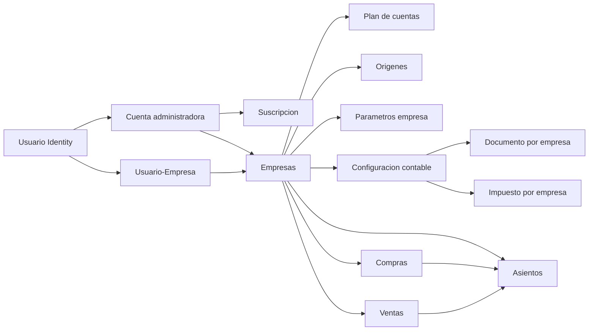

# DOCUMENTACION BD Y FUNCIONALIDADES - SisAdm

Ultima actualizacion: 26/06/2026
Proyecto: `SistemaAdministrativoWeb`  
Base de datos: `Dbsisadm`  
Arquitectura definida: ASP.NET Core MVC + ASP.NET Identity + ADO.NET + Stored Procedures + SQL Server

## 1. Objetivo del sistema

SisAdm es un sistema web administrativo contable multiempresa orientado a contadores o administradores que gestionan una o varias empresas desde una misma cuenta de usuario.

El objetivo inicial del sistema es reemplazar y modernizar los conceptos principales del sistema VB6 anterior, priorizando:

- Registro de provisiones de compras.
- Registro de provisiones de ventas.
- Registro de asientos contables manuales y automaticos.
- Mantenimientos base contables.
- Configuracion contable por empresa.
- Seguridad, suscripcion y control de usuarios administradores.

El sistema no maneja una empresa por usuario como restriccion fija. El modelo correcto es:

- Un usuario puede pertenecer a una cuenta administradora.
- Una cuenta administradora puede tener una suscripcion.
- Una cuenta administradora puede administrar varias empresas.
- Un usuario puede operar una o varias empresas segun la tabla de relacion.
- Cada empresa mantiene sus propios parametros, plan contable, origenes, reglas y registros operativos.

Ejemplo conceptual:

- `llara@gmail.com` puede operar empresas 1, 2 y 3.
- `loka@gmail.com` puede operar empresas 4, 5 y 6.

## 2. Tecnologias principales

- Framework: ASP.NET Core MVC.
- Target framework: `.NET 10.0`.
- Autenticacion base: ASP.NET Identity.
- Base de datos Identity: integrada en `ApplicationDbContext`.
- Base de datos de negocio: SQL Server, base `Dbsisadm`.
- Acceso a datos de negocio: ADO.NET con `Microsoft.Data.SqlClient`.
- Contrato de acceso a datos: repositorios por modulo.
- Persistencia de negocio: Stored Procedures.
- UI: Razor Views, Bootstrap, Bootstrap Icons, CSS propio en `wwwroot/css/site.css`.
- Sesion: ASP.NET Core Session para empresa activa.
- Autenticacion externa: Google, configurable por secrets.
- Captcha: Cloudflare Turnstile, configurable por secrets.

## 3. Rutas principales del proyecto

- Proyecto web: `C:\Users\Franco Lara\Desktop\GitHub Proyectos\Proyectos\.NET2026\SistemaAdministrativoWeb`
- Scripts de base de datos: `C:\Users\Franco Lara\Desktop\GitHub Proyectos\Proyectos\Basededatos\Dbsisadm`
- Tablas: `C:\Users\Franco Lara\Desktop\GitHub Proyectos\Proyectos\Basededatos\Dbsisadm\Tablas`
- Stored Procedures: `C:\Users\Franco Lara\Desktop\GitHub Proyectos\Proyectos\Basededatos\Dbsisadm\StoreProcedure`
- Scripts incrementales: `C:\Users\Franco Lara\Desktop\GitHub Proyectos\Proyectos\Basededatos\Dbsisadm\Script`

## 4. Configuracion y secrets

El proyecto carga configuracion sensible desde User Secrets en desarrollo.

Ruta esperada de secrets:

`C:\Users\Franco Lara\AppData\Roaming\Microsoft\UserSecrets\aspnet-SistemaAdministrativoWeb-53c45fe8-ede4-4ae5-9d55-e176dba84e4e\secrets.json`

Tambien intenta cargar:

`C:\Users\Franco Lara\AppData\Roaming\Microsoft\UserSecrets\aspnet-SistemaAdministrativoWeb-53c45fe8-ede4-4ae5-9d55-e176dba84e4e\secretsLocal.json`

Claves principales:

- `ConnectionStrings:DefaultConnection`: cadena SQL Server hacia `Dbsisadm`.
- `Authentication:Google:ClientId`: cliente OAuth Google.
- `Authentication:Google:ClientSecret`: secreto OAuth Google.
- `CloudflareTurnstile:SiteKey`: clave publica Turnstile.
- `CloudflareTurnstile:SecretKey`: clave privada Turnstile.
- `IdentityBehavior:RequireConfirmedAccount`: obliga o no confirmacion de cuenta.
- `IdentityBehavior:AutoConfirmEmail`: permite autoconfirmar correo en desarrollo.
- `IdentitySeed:SuperAdminEmails`: correos que deben recibir rol de superadmin.
- `RutasLocales:BaseDatosRootPath`: ruta raiz SQL del proyecto.
- `RutasLocales:SqlTablasPath`: ruta de tablas.
- `RutasLocales:SqlStoreProcedurePath`: ruta de procedimientos.
- `RutasLocales:SqlScriptPath`: ruta de scripts incrementales.

Archivo ejemplo disponible:

- `appsettings.Secrets.example.json`

## 5. Flujo de arranque ASP.NET Core

El arranque se define en `Program.cs`.

Orden principal:

1. Carga de configuracion y secrets en desarrollo.
2. Lectura de `ConnectionStrings:DefaultConnection`.
3. Registro de `ApplicationDbContext` para Identity.
4. Configuracion de Identity con roles.
5. Configuracion opcional de Google.
6. Registro de MVC.
7. Registro de sesion.
8. Registro de repositorios ADO.NET.
9. Registro de servicios de seguridad y Turnstile.
10. Seed inicial de roles y usuarios superadmin.
11. Pipeline HTTP: HTTPS, routing, session, authentication, authorization.
12. Rutas MVC, areas y Razor Pages.

## 6. Identidad y seguridad

Identity usa las tablas estandar de ASP.NET Identity generadas por migraciones EF Core.

Modelo actual:

- `ApplicationDbContext` hereda de `IdentityDbContext<IdentityUser, IdentityRole, string>`.
- Se usan roles mediante `AddRoles<IdentityRole>()`.
- Se registran usuarios desde `Areas/Identity/Pages/Account/Register`.
- Login local y login externo Google desde `Areas/Identity/Pages/Account/Login`.
- Se usa Cloudflare Turnstile en registro y login cuando esta configurado.
- La politica de clave exige longitud minima 6, digito, minuscula, mayuscula y caracter especial.
- `IdentityStartupSeeder` crea roles y asigna superadmin segun `IdentitySeed:SuperAdminEmails`.

## 7. Modelo multiempresa

La empresa activa se guarda en sesion mediante `SessionCurrentCompanyAccessor`.

Componentes:

- `ICurrentCompanyAccessor`: contrato para leer el contexto de empresa activa.
- `SessionCurrentCompanyAccessor`: implementacion basada en session.
- `EmpresaContextoController`: seleccion y registro de empresas.
- `SEG_UsuarioEmpresa`: relacion usuario-empresa.
- `SEG_CuentaAdministradora`: cuenta administradora propietaria de la suscripcion.
- `SEG_UsuarioCuentaAdministradora`: relacion usuario-cuenta administradora.
- `SEG_Empresa`: empresas disponibles.

Reglas funcionales:

- Si el usuario no tiene empresa asignada debe abrir el registro de empresa inicial.
- El usuario puede registrar otra empresa desde la seleccion de empresa.
- La empresa activa condiciona todos los mantenimientos y registros contables.
- Los registros contables siempre deben persistirse con `IdEmpresa`.

## 8. Estructura visual y navegacion

Layout principal:

- `Views/Shared/_Layout.cshtml`

Tipos de shell:

- Publico: login, registro e inicio.
- Administrador: panel contable multiempresa.
- Plataforma: panel superadmin para suscriptores.

Menu administrador:

- General: Dashboard, Empresas.
- Mantenimiento: Plan de cuentas, Centros de costo, Cuentas corrientes, Personas, Origenes, Cuentas destino, Configuracion contable.
- Registro: Asientos, Compras, Ventas, Caja y Bancos, Transferencias, Aplicaciones.
- Reportes: Libros, Analisis. Actualmente deshabilitados.

El mantenimiento independiente de parametros fue retirado. La parametrizacion operativa debe gestionarse desde Configuracion contable.

## 9. Modulos funcionales

### 9.1 Inicio

Controlador:

- `HomeController`

Funciones:

- Redirige segun contexto de usuario y empresa.
- Muestra pantalla inicial publica.
- Maneja vista de privacidad y error.

### 9.2 Registro y login

Archivos:

- `Areas/Identity/Pages/Account/Register.cshtml`
- `Areas/Identity/Pages/Account/Register.cshtml.cs`
- `Areas/Identity/Pages/Account/Login.cshtml`
- `Areas/Identity/Pages/Account/Login.cshtml.cs`

Funciones:

- Registro solo de usuario.
- Login por correo y password.
- Login con Google.
- Validacion Turnstile.
- Mensajes de validacion para reglas de password.

### 9.3 Seleccion y registro de empresa

Controlador:

- `EmpresaContextoController`

Vistas:

- `Views/EmpresaContexto/Index.cshtml`
- `Views/EmpresaContexto/RegistrarEmpresaInicial.cshtml`

Funciones:

- Lista empresas vinculadas al usuario.
- Permite seleccionar empresa activa.
- Permite registrar empresa inicial o empresa adicional.
- Al registrar empresa se crea la relacion de usuario y se cargan parametros base.

### 9.4 Panel principal

Controlador:

- `PanelController`

Vista:

- `Views/Panel/Index.cshtml`

Funciones:

- Dashboard base por empresa activa.
- Entrada al menu operativo.

### 9.5 Panel superadmin de plataforma

Controlador:

- `PlataformaController`

Vista:

- `Views/Plataforma/Index.cshtml`

Funciones:

- Control de cuentas administradoras.
- Visualizacion de suscripciones.
- Alta, baja o actualizacion de datos de suscripcion.
- Gestion operativa de clientes/suscriptores de la plataforma.

### 9.6 Plan de cuentas

Controlador:

- `PlanCuentaController`

Vistas:

- `Views/PlanCuenta/Index.cshtml`
- `Views/PlanCuenta/Formulario.cshtml`

Funciones:

- Listado paginado de cuentas contables por empresa.
- Filtro por texto y nivel.
- Registro y edicion de cuentas.
- Popup reutilizable para seleccionar cuenta padre.
- Permite configurar cuentas destino y contrapartida desde el mismo mantenimiento cuando la cuenta es operativa o de ultimo nivel.
- Carga default desde `CON_PlanCuentaMaestro`.
- Validacion de jerarquia por niveles usando parametros:
  `GRADO_MAXIMO`, `GRADO1_LONG`, `GRADO2_LONG`, `GRADO3_LONG`, `GRADO4_LONG`, `GRADO5_LONG`.

Campos relevantes:

- Codigo de cuenta.
- Cuenta padre.
- Nombre.
- Nivel.
- `ColBalance` con valores funcionales: Saldo, Inventario, Naturaleza, Funcion, Resultado.
- Moneda opcional.
- Tipo de cambio opcional.
- Acepta movimiento.
- Requiere centro de costo.
- Estado.

### 9.7 Personas

Controlador:

- `PersonaController`

Vistas:

- `Views/Persona/Index.cshtml`
- `Views/Persona/Formulario.cshtml`

Funciones:

- Listado paginado de personas por empresa.
- Filtro por texto, tipo persona, cliente y proveedor.
- Registro y edicion de persona.
- Ubigeo por departamento, provincia y distrito.
- Tipo de persona: Natural o Juridica.
- Tipo de documento desde `TiposDocumentoIdentidadSunat`.
- Si se marca cliente, crea o actualiza `ADM_Cliente`.
- Si se marca proveedor, crea o actualiza `ADM_Proveedor`.
- Si no se marca cliente/proveedor, queda solo como persona.

### 9.8 Origenes contables

Controlador:

- `OrigenController`

Vistas:

- `Views/Origen/Index.cshtml`
- `Views/Origen/Formulario.cshtml`

Funciones:

- Listado paginado de origenes por empresa.
- Registro y edicion de origen contable.
- Carga default desde `CON_OrigenMaestro`.
- Uso posterior en asientos, compras, ventas y configuracion contable.

### 9.8.1 Centros de costo

Controlador:

- `CentroCostoController`

Vistas:

- `Views/CentroCosto/Index.cshtml`
- `Views/CentroCosto/Formulario.cshtml`

Funciones:

- Listado paginado de centros de costo por empresa.
- Registro y edicion sobre `CON_CentroCostoConfiguracionEmpresa`.
- Ayuda popup reutilizable para seleccionar centros de costo en el asiento manual.
- Validacion operativa: si la cuenta contable requiere centro de costo, la linea del asiento debe informarlo.

### 9.8.2 Cuentas corrientes

Controlador:

- `CuentaCorrienteController`

Vistas:

- `Views/CuentaCorriente/Index.cshtml`
- `Views/CuentaCorriente/Formulario.cshtml`

Funciones:

- Listado paginado de cuentas corrientes bancarias por empresa.
- Registro y edicion sobre `CON_BancosConfiguracionEmpresa`.
- Registro de titular y moneda operativa usando el mismo maestro `ADM_Moneda` de provisiones y asientos.
- Ayuda popup de bancos basada en el catalogo maestro `CON_Bancos`.
- Ayuda popup de plan de cuentas para amarrar la cuenta corriente a una cuenta contable activa de movimiento.

### 9.9 Cuentas destino

Controlador:

- `CuentaDestinoReglaController`

Vistas:

- `Views/CuentaDestinoRegla/Index.cshtml`
- `Views/CuentaDestinoRegla/Formulario.cshtml`

Funciones:

- Define cuentas destino por empresa y cuenta contable origen.
- Permite configurar cuenta origen, destino y contrapartida sin filtro por ejercicio.
- La misma configuracion puede mantenerse tambien desde `PlanCuentaController` para cuentas de ultimo nivel.
- Hereda reglas base desde tablas maestras cuando corresponda.
- Base conceptual rescatada del VB6: cuentas que disparan cuentas destino contables.

### 9.10 Configuracion contable

Controlador:

- `ConfiguracionContabilizacionController`

Vista principal:

- `Views/ConfiguracionContabilizacion/Index.cshtml`

Parcial:

- `Views/ConfiguracionContabilizacion/_ImpuestoContableTab.cshtml`

Funciones actuales:

- Vista directa con tabs tipo tarjeta.
- Configura provisiones por tipo de operacion desde una sola tarjeta.
- Configura documentos por empresa.
- Configura impuestos por empresa.
- Centraliza parametros contables que antes estaban separados.

Tabs:

- Provision.
- Documento.
- Impuesto.
- Parametros.

Provision:

- Subtarjetas operativas para:
  `Compras`, `Ventas`, `Egresos`, `Ingresos` y `Aplicaciones`.
- Cada subtarjeta guarda una fila en `CON_ConfiguracionContabilizacion` con escenario `PROVISION`.
- Origen contable seleccionado mediante popup.
- Genera asiento automatico.
- Configuracion activa.

Documento:

- Lee documentos desde `ADM_TipoComprobante`.
- Tiene subtabs Ventas y Compras.
- Por empresa se guardan cuentas contables para:
  `IdCuentaVentaSoles`, `IdCuentaVentaDolares`, `IdCuentaCompraSoles`, `IdCuentaCompraDolares`.
- La configuracion por empresa se guarda en `CON_DocumentoConfiguracionEmpresa`.

Impuesto:

- Lee impuestos desde `CON_TipoImpuesto`.
- La tabla maestra tambien puede tener cuenta base.
- La configuracion por empresa se guarda en `CON_TipoImpuestoConfiguracionEmpresa`.
- Actualmente se usa un solo campo `IdPlanCuenta`.
- La cuenta `SPOT` ya no se administra desde esta tarjeta.

Parametros:

- Lee parametros desde `ADM_ParametroEmpresa` para la empresa activa.
- Solo expone parametros cuyo `TipoParametro <> 'NA'`.
- Muestra `DescripcionParametro` y permite seleccionar una cuenta contable con la ayuda del plan.
- Guarda el codigo de cuenta seleccionado en `ValorParametro`.
- El parametro `CTADETRACCION` define la cuenta contable usada por el asiento adicional de detracciones en compras.

### 9.11 Asientos contables

Controlador:

- `AsientoController`

Vistas:

- `Views/Asiento/Index.cshtml`
- `Views/Asiento/Formulario.cshtml`

Funciones:

- Listado paginado por empresa y periodo.
- Filtro por anio, mes y texto.
- Registro y edicion de asiento manual.
- Popup para cuenta contable.
- Popup para origen.
- Popup para centro de costo con seleccion por empresa activa.
- Detalle con glosa, centro de costo, RUC/DNI, tipo documento, serie, referencia, TC, debe y haber.
- El formulario muestra mes contable informativo y fecha de emision.
- La fecha de contabilizacion se fija automaticamente segun el periodo contable del registro.
- El centro de costo es obligatorio solo cuando la cuenta seleccionada tiene activado `RequiereCentroCosto`.
- El resumen de Debe/Haber/Diferencia cambia visualmente segun el asiento este cuadrado o no.
- El asiento manual puede quedar descuadrado; el sistema ya no obliga el cuadre para guardar.
- El guardado deja el estado del asiento en `PROVISIONADO`.
- Si una cuenta del detalle tiene configuracion en `Cuentas destino`, la linea original se conserva y se agregan lineas adicionales de destino y contrapartida.
- El listado muestra el nombre del origen y agrega accion de eliminar.
- La eliminacion directa bloquea asientos automaticos y exige eliminarlos desde su modulo de origen.
- Correlativo por empresa, origen y periodo.

### 9.12 Compras

Controlador:

- `CompraController`

Vistas:

- `Views/Compra/Index.cshtml`
- `Views/Compra/Formulario.cshtml`

Funciones:

- Listado paginado por empresa y periodo.
- Filtro por anio, mes y texto.
- Registro y edicion de compras.
- Eliminacion de compras desde el listado.
- Ayuda popup de proveedores.
- Creacion rapida de proveedor.
- Si se crea proveedor rapido se inserta persona y proveedor con ubigeo por defecto `150101`.
- Al seleccionar proveedor se autocompletan datos.
- Periodo contable visible en la parte superior del formulario solo como referencia del periodo elegido en el listado.
- Detalle con cuenta contable seleccionada por popup y tipo de afectacion IGV.
- Tipo de afectacion IGV por defecto: `10 - Gravado - Operacion Onerosa`.
- Totales globales calculados desde el detalle: subtotal, total exonerado, total inafecto, IGV e importe total.
- Los totales globales no son editables desde el formulario.
- Guarda compra y genera asiento contable segun configuracion.

### 9.13 Ventas

Controlador:

- `VentaController`

Vistas:

- `Views/Venta/Index.cshtml`
- `Views/Venta/Formulario.cshtml`

Funciones:

- Listado paginado por empresa y periodo.
- Filtro por anio, mes y texto.
- Registro y edicion de ventas.
- Eliminacion de ventas desde el listado.
- Ayuda popup de clientes.
- Creacion rapida de cliente.
- Si se crea cliente rapido se inserta persona y cliente con ubigeo por defecto `150101`.
- Al seleccionar cliente se autocompletan datos.
- Periodo contable visible en la parte superior del formulario solo como referencia del periodo elegido en el listado.
- Guarda venta y genera asiento contable segun configuracion.
- Permite previsualizar asiento desde la informacion ingresada.

### 9.14 Caja y Bancos

Controlador:

- `CajaBancoController`

Vistas:

- `Views/CajaBanco/Index.cshtml`
- `Views/CajaBanco/Formulario.cshtml`

Funciones:

- Listado paginado de movimientos bancarios por empresa.
- Filtro por cuenta corriente, anio, mes y texto.
- KPIs de saldo inicial, ingresos del mes, egresos del mes y saldo final.
- Registro y edicion de movimientos bancarios.
- Seleccion de tipo de flujo `Ingreso` o `Egreso`.
- Seleccion de operacion bancaria desde la tabla `operacionesbancarias` filtrando `Destino = 'I'` o `Destino = 'E'`.
- Seleccion de persona relacionada mediante popup.
- Cabecera del movimiento con `Nro movimiento`, `Fecha emision`, `Tipo de cambio`, `Nro de Operacion`, `Glosa`, `Observaciones` e `Importe total` editable para representar el total de la operacion.
- Detalle contable con cuenta, persona por linea, glosa, centro de costo, debe y haber.
- Popup reutilizable para ayuda de cuenta contable y centro de costo.
- Cada linea del detalle puede seleccionar una persona distinta para reutilizar la ayuda de comprobantes con saldo.
- El formulario muestra `Total Operacion`, `Total Detalle` y `Diferencia`, comparando el importe de cabecera contra el neto del detalle segun sea ingreso o egreso.
- Al guardar el movimiento bancario se genera y mantiene un asiento contable automatico con origen `ING` o `EGR` segun el tipo de flujo configurado en contabilidad.
- Si una cuenta del detalle tiene configuracion en `Cuentas destino`, el asiento conserva la linea original y agrega sus lineas de destino y contrapartida.
- La operacion bancaria elegida debe corresponder al destino `Ingreso` o `Egreso` configurado en `operacionesbancarias`.
- Cada movimiento de Caja y Bancos tiene un correlativo interno mensual independiente del `Nro documento`; reinicia en `1` por empresa y periodo de `FechaEmision`.
- Para guardar el detalle solo se exige `Cuenta`, `Glosa detalle` y un importe en `Debe` o `Haber`; persona, comprobante y centro de costo quedan opcionales.
- El guardado del movimiento bancario exige que la diferencia entre `Total Operacion` y `Total Detalle` sea exactamente cero.
- El listado de Caja y Bancos exige seleccionar una cuenta corriente antes de consultar y muestra el `NumeroAsiento` vinculado.
- Las ayudas popup de cuenta contable restringen la seleccion a cuentas del ultimo nivel.

### 9.15 Transferencias entre cuentas

Controlador:

- `TransferenciaCuentaController`

Vistas:

- `Views/TransferenciaCuenta/Index.cshtml`
- `Views/TransferenciaCuenta/Formulario.cshtml`

Funciones:

- Registra transferencias internas entre dos cuentas corrientes de la misma empresa sin crear tablas nuevas.
- Cada transferencia genera dos movimientos bancarios enlazados en `BAN_MovimientoBanco`: un `Egreso` para el emisor y un `Ingreso` para el receptor.
- Las operaciones bancarias del modulo se toman de `operacionesbancarias` filtrando `idTipoOpeBancaria = 'T'`, usando `Destino = 'E'` para el emisor y `Destino = 'I'` para el receptor.
- El bloque emisor captura `Fecha`, `Tipo de cambio`, `Nro operacion`, `Monto`, `Glosa` y `Observaciones`.
- El bloque receptor captura la misma informacion operativa, pero el `Monto` se calcula automaticamente segun la moneda de ambas cuentas y el `Tipo de cambio` queda bloqueado sincronizado desde el emisor.
- Si ambas cuentas tienen la misma moneda, el importe receptor es igual al emisor; si cambian entre `PEN` y `USD`, se multiplica o divide por el tipo de cambio.
- La `Glosa`, `Observaciones`, `Fecha` y `Nro operacion` del emisor se replican al receptor como valor inicial; el usuario puede ajustar el texto del receptor antes de guardar.
- En el detalle generado de la transferencia, la `GlosaDetalle` referencia la cuenta corriente contraria con el formato `Banco <NroCuentaCorriente>` y el `Nro operacion` se guarda en `ReferenciaLinea`, no en `RUC/DNI`.
- Cada movimiento generado crea y mantiene su asiento contable automatico reutilizando la logica de ingresos y egresos ya configurada, solo si la operacion bancaria correspondiente tiene `indTranConta = 'S'`.
- El listado del modulo une emisor y receptor a partir del enlace funcional guardado en `BAN_MovimientoBanco` y permite eliminar la transferencia completa.

### 9.16 Aplicaciones

Controlador:

- `AplicacionController`

Vistas:

- `Views/Aplicacion/Index.cshtml`
- `Views/Aplicacion/Formulario.cshtml`

Funciones:

- Registra aplicaciones entre un comprobante pendiente y una nota de credito del mismo cliente o proveedor.
- El tipo de trabajo se define como `Cliente` o `Proveedor`; internamente usa `VEN` para clientes y `COM` para proveedores.
- La ayuda operativa superior muestra comprobantes pendientes con saldo y la inferior muestra solo notas de credito (`TipoComprobante = '07'`) con saldo.
- Cada registro de aplicacion enlaza un solo comprobante con una sola nota de credito, permitiendo importes parciales.
- Si el importe aplicado no consume el saldo completo, el saldo restante permanece en el comprobante o en la nota de credito para aplicaciones futuras.
- El proceso genera asiento contable usando la provision `APNC` configurada en `CON_ConfiguracionContabilizacion`.
- El asiento se construye con las cuentas documentarias configuradas por tipo de comprobante y moneda, tomando la cuenta del comprobante y la cuenta de la nota de credito.
- El listado del modulo muestra persona, comprobante aplicado, nota de credito usada, importe aplicado y numero de asiento.
- La eliminacion de una aplicacion restaura el saldo del comprobante y de la nota de credito antes de borrar el asiento relacionado.

## 10. Repositorios ADO.NET

Todos los repositorios usan `IDbConnectionFactory` y `SqlConnectionFactory`.

Repositorios principales:

- `PlanCuentaRepository`
- `OrigenRepository`
- `CuentaDestinoReglaRepository`
- `ConfiguracionContabilizacionRepository`
- `AsientoRepository`
- `CompraRepository`
- `VentaRepository`
- `CajaBancoRepository`
- `AplicacionNotaCreditoRepository`
- `PersonaRepository`
- `ClienteRepository`
- `ProveedorRepository`
- `TipoComprobanteRepository`
- `MonedaRepository`
- `EmpresaRepository`
- `EmpresaAdministracionRepository`
- `ParametroEmpresaRepository`

Nota: `ParametroEmpresaRepository` no tiene mantenimiento independiente visible. Se conserva como infraestructura para uso interno desde configuracion contable o flujos de carga default.

## 11. Base de datos - organizacion por prefijo

### ADM

Administracion y catalogos funcionales.

- `ADM_Persona`: personas por empresa.
- `ADM_Cliente`: marca comercial de persona como cliente.
- `ADM_Proveedor`: marca comercial de persona como proveedor.

### BAN

Movimiento de caja y bancos.

- `BAN_MovimientoBanco`: cabecera del movimiento bancario por empresa y cuenta corriente. Incluye `NumeroMovimiento` como correlativo interno por empresa y periodo, ademas de `TipoCambio`, `Observacion`, `IdTransferenciaCuenta`, `RolTransferencia` e `IdMovimientoBancoRelacionado`.
- `BAN_MovimientoBancoDetalle`: detalle contable del movimiento bancario, con persona por linea, centro de costo, referencias documentarias por codigo SUNAT (`IdPersona`, `NumeroDocumento`, `TipoDocumento`, `Serie`, `ReferenciaLinea`, `TipoCambioLinea`) e importes equivalentes por moneda (`TotalImporteS`, `TotalImporteD`).

### CON

Configuracion y catalogos contables por empresa.

- `CON_Bancos`: catalogo maestro de bancos.
- `CON_BancosConfiguracionEmpresa`: cuentas corrientes bancarias por empresa, con banco y cuenta contable asociada.
- `ADM_Moneda`: monedas activas.
- `ADM_TipoCambio`: tipos de cambio.
- `ADM_TipoComprobante`: comprobantes SUNAT y cuentas maestras.
- `ADM_ParametroMaestro`: parametros base internos, no por empresa.
- `ADM_ParametroEmpresa`: parametros copiados y editables por empresa.

### CON

Contabilidad.

- `CON_PlanCuentaMaestro`: plan de cuentas base interno, no por empresa.
- `CON_PlanCuenta`: plan de cuentas por empresa.
- `CON_OrigenMaestro`: origenes base internos.
- `CON_Origen`: origenes por empresa.
- `CON_CuentaDestinoReglaMaestro`: reglas destino base internas.
- `CON_CuentaDestinoReglaDetalleMaestro`: detalle de reglas destino base internas.
- `CON_CuentaDestinoRegla`: cuentas destino por empresa y cuenta origen.
- `CON_CuentaDestinoReglaDetalle`: detalle de cuentas destino por empresa.
- `CON_ConfiguracionContabilizacion`: configuracion de provision compra/venta por empresa.
- `CON_ConfiguracionContabilizacionDetalle`: detalle legacy de configuracion contable.
- `CON_DocumentoConfiguracionEmpresa`: cuentas contables por documento y empresa.
- `CON_Bancos`: catalogo maestro de bancos para ayudas operativas.
- `CON_BancosConfiguracionEmpresa`: cuentas corrientes bancarias por empresa vinculadas a una cuenta contable, con titular e identificador de moneda (`IdMoneda`).
- `CON_TipoImpuesto`: catalogo maestro de impuestos.
- `CON_TipoImpuestoConfiguracionEmpresa`: configuracion de cuenta de impuesto por empresa.
- `CON_TipoAfectacionIGV`: catalogo maestro de afectaciones IGV SUNAT usado por compras y ventas.
- `CON_Asiento`: cabecera de asiento. Incluye `FechaEmision` y `FechaAsiento` como fechas separadas.
- `CON_AsientoDetalle`: detalle de asiento con datos documentarios por codigo SUNAT e importes equivalentes por moneda (`TotalImporteS`, `TotalImporteD`).
- `CON_CorrelativoAsiento`: correlativo por empresa, origen y periodo.

### COM

Compras.

- `COM_Compra`: cabecera de compra. Incluye subtotal, total exonerado, total inafecto, ICBPER interno, IGV, importe total y saldo del comprobante.
- `COM_CompraDetalle`: detalle de compra. Incluye cuenta contable y tipo de afectacion IGV por linea.

### VEN

Ventas.

- `VEN_Venta`: cabecera de venta. Incluye subtotal, total exonerado, total inafecto, ICBPER interno, IGV, importe total y saldo del comprobante.
- `VEN_VentaDetalle`: detalle de venta. Incluye cuenta contable y tipo de afectacion IGV por linea.

### SEG

Seguridad funcional, empresas y suscripciones.

- `SEG_CuentaAdministradora`: cuenta administradora de suscripcion.
- `SEG_UsuarioCuentaAdministradora`: usuarios vinculados a cuenta administradora.
- `SEG_CuentaAdministradoraSuscripcion`: contrato/suscripcion vigente.
- `SEG_CuentaAdministradoraSuscripcionMovimiento`: historial de movimientos.
- `SEG_CuentaAdministradoraSuscripcionPago`: pagos de suscripcion.
- `SEG_Empresa`: empresas registradas.
- `SEG_UsuarioEmpresa`: relacion usuario-empresa.
- `SEG_UsuarioPerfil`: datos complementarios del usuario.

### Catalogos externos

- `TiposDocumentoIdentidadSunat`: documentos de identidad SUNAT.
- `UbigeoDepartamentos`: departamentos.
- `UbigeoProvincias`: provincias.
- `UbigeoDistritos`: distritos.

## 12. Stored Procedures por modulo

### ADM

- `usp_ADM_CargarParametrosDefaultEmpresa`
- `usp_ADM_GuardarParametroEmpresa`
- `usp_ADM_GuardarPersona`
- `usp_ADM_ListarClientesActivosPorEmpresa`
- `usp_ADM_ListarMonedasActivas`
- `usp_ADM_ListarParametrosPorEmpresa`
- `usp_ADM_ListarDetraccionesSunat`
- `usp_ADM_ListarPersonasPorEmpresa`
- `usp_ADM_ListarProveedoresActivosPorEmpresa`
- `usp_ADM_ListarTiposComprobanteActivos`
- `usp_ADM_ListarTiposDocumentoIdentidadSunat`
- `usp_ADM_ListarUbigeoDepartamentos`
- `usp_ADM_ListarUbigeoDistritos`
- `usp_ADM_ListarUbigeoProvincias`
- `usp_ADM_ObtenerParametroEmpresa`
- `usp_ADM_ObtenerPersona`

### CON

- `usp_CON_CargarCuentasDestinoDefaultEmpresa`
- `usp_CON_CargarOrigenesDefaultEmpresa`
- `usp_CON_CargarPlanCuentaDefaultEmpresa`
- `usp_CON_EliminarConfiguracionContabilizacion`
- `usp_CON_EliminarAsiento`
- `usp_CON_EliminarCuentaDestinoRegla`
- `usp_CON_GenerarOrigenesBaseEmpresa`
- `usp_CON_GuardarAsientoManual`
- `usp_CON_GuardarBancoConfiguracionEmpresa`
- `usp_CON_GuardarCentroCostoConfiguracionEmpresa`
- `usp_CON_GuardarConfiguracionContabilizacion`
- `usp_CON_GuardarCuentaDestinoRegla`
- `usp_CON_GuardarDocumentoConfiguracionEmpresa`
- `usp_CON_GuardarImpuestoConfiguracionEmpresa`
- `usp_CON_GuardarOrigenPorEmpresa`
- `usp_CON_GuardarPlanCuentaPorEmpresa`
- `usp_CON_GuardarProvisionContableEmpresa`
- `usp_CON_ListarAsientosPorEmpresa`
- `usp_CON_ListarBancos`
- `usp_CON_ListarBancosConfiguracionEmpresa`
- `usp_CON_ListarCentroCostoConfiguracionEmpresa`
- `usp_CON_ListarConfiguracionContabilizacionPorEmpresa`
- `usp_CON_ListarCuentasDestinoReglaPorEmpresa`
- `usp_CON_ListarOrigenesActivos`
- `usp_CON_ListarPlanCuentaPorEmpresa`
- `usp_CON_ListarTiposAfectacionIGV`
- `usp_CON_ObtenerAsiento`
- `usp_CON_ObtenerConfiguracionContabilizacion`
- `usp_CON_ObtenerConfiguracionContableEmpresa`
- `usp_CON_ObtenerCuentaDestinoRegla`
- `usp_CON_ObtenerSiguienteNumeroAsiento`

### COM

- `usp_COM_GuardarCompraConAsiento`
- `usp_COM_EliminarCompra`
- `usp_COM_ListarComprasPorEmpresa`
- `usp_COM_ObtenerCompra`

### VEN

- `usp_VEN_GuardarVentaConAsiento`
- `usp_VEN_EliminarVenta`
- `usp_VEN_ListarVentasPorEmpresa`
- `usp_VEN_ObtenerVenta`

### SEG

- `usp_SEG_ActualizarSuscripcionCuentaAdministradora`
- `usp_SEG_AsignarUsuarioEmpresa`
- `usp_SEG_GuardarUsuarioPerfil`
- `usp_SEG_ListarCuentasAdministradorasSuscripcion`
- `usp_SEG_ListarEmpresasPorUsuario`
- `usp_SEG_ObtenerContextoSuscripcionPorEmpresa`
- `usp_SEG_RegistrarCuentaAdministradoraConEmpresa`
- `usp_SEG_RegistrarEmpresaCuentaAdministradora`
- `usp_BAN_ListarOperacionesBancarias`
- `usp_BAN_ObtenerResumenMovimientoBanco`
- `usp_BAN_ListarMovimientosBancoPorEmpresa`
- `usp_BAN_ObtenerMovimientoBanco`
- En los `SP` de caja y bancos la persona vinculada se muestra usando `ADM_Persona.NombreCompleto` o `RazonSocial`, segun tipo de persona, para evitar dependencias con columnas legacy no vigentes.
- `usp_BAN_GuardarMovimientoBanco`
- `usp_BAN_GuardarTransferenciaCuenta`
- `usp_BAN_ListarTransferenciasCuentaPorEmpresa`
- `usp_BAN_EliminarTransferenciaCuenta`
- Los procedimientos `usp_BAN_GuardarMovimientoBanco` y `usp_BAN_ObtenerMovimientoBanco` ahora persisten y devuelven tambien `TipoCambio` y `Observacion` en la cabecera del movimiento.
- El asiento contable de Caja y Bancos, incluido el usado por transferencias entre cuentas, solo se genera si la operacion bancaria configurada tiene `indTranConta = 'S'`; en caso contrario el proceso guarda solo `BAN_MovimientoBanco`.
- Los `SP` de caja y bancos devuelven y persisten tambien la persona por linea junto con las referencias documentarias para reutilizar comprobantes desde el detalle del movimiento.
- Los movimientos bancarios ahora guardan por linea el modulo de origen (`COM`/`VEN`) y el `IdRegistroComprobante`, usando ese enlace para descontar o restaurar el `Saldo` pendiente de compras y ventas al grabar, editar o eliminar el movimiento.
- `usp_BAN_EliminarMovimientoBanco`
- Los movimientos bancarios enlazados a una transferencia no pueden eliminarse individualmente desde Caja y Bancos; deben eliminarse como transferencia completa, limpiando primero la relacion a `CON_Asiento` antes de borrar el asiento asociado.

### APL

- `usp_APL_ListarComprobantesPendientesPorPersona`
- `usp_APL_ListarAplicacionesPorEmpresa`
- `usp_APL_GuardarAplicacionNotaCredito`
  Genera el asiento APNC con estado final `PROVISIONADO` cuando la configuración automática está activa.
- `usp_APL_EliminarAplicacionNotaCredito`

## 13. Scripts incrementales existentes

- `001_Seed_ADM_Moneda.sql`: monedas base.
- `002_Seed_CON_Origen.sql`: origenes iniciales.
- `003_Reestructurar_Suscripcion_Por_Cuenta_Administradora.sql`: cambio de suscripcion por cuenta administradora.
- `004_Reestructurar_Correlativo_Asiento_Por_Periodo.sql`: correlativo por empresa/origen/periodo.
- `005_Seed_ADM_TipoComprobante.sql`: comprobantes SUNAT.
- `006_Despliegue_Configuracion_Compras_Ventas.sql`: estructura inicial de configuracion compra/venta.
- `007_Personas_Ubigeo_TipoDocumento.sql`: personas, ubigeo y tipo documento.
- `008_Seed_Maestros_Contables_Parametros.sql`: maestros internos y parametros.
- `009_Renombrar_NaturalezaSaldo_PlanCuenta.sql`: cambio a `ColBalance` y moneda/tipo cambio.
- `010_AsientoDetalle_DatosDocumentarios.sql`: datos documentarios en detalle de asiento.
- `011_Configuracion_Contable_Tabs.sql`: configuracion contable con tabs.
- `012_Documento_Cuentas_Compras_Ventas.sql`: cuentas compra/venta por documento.
- `013_Unificar_Configuracion_Impuestos.sql`: unificacion de configuracion de impuestos.
- `014_Compras_Detalle_Afectacion_IGV_ICBPER.sql`: cuenta contable y afectacion IGV por detalle de compra; subtotal, exonerado, inafecto e ICBPER interno en cabecera.
- `015_Ventas_Detalle_Afectacion_IGV_Totales.sql`: cuenta contable y afectacion IGV por detalle de venta; subtotal, exonerado, inafecto e ICBPER interno en cabecera.
- `016_AsientoDetalle_TipoDocumento_Comprobante.sql`: amplia `CON_AsientoDetalle.TipoDocumento`; desde la actualizacion del 26/06/2026 el sistema guarda el codigo SUNAT del comprobante (`01`, `03`, `07`, `00`, etc.) en lugar de la descripcion.
- `017_Asiento_FechaEmision_Eliminacion_Registros.sql`: agrega `FechaEmision` en `CON_Asiento` y documenta el despliegue de eliminacion para compras, ventas y asientos.
- `018_Compras_Ventas_Saldo_Comprobantes.sql`: agrega `Saldo` en `COM_Compra` y `VEN_Venta`, inicializandolo con el importe total actual.
- `019_Provision_Operaciones_Adicionales.sql`: amplia los modulos permitidos de provision para egresos, ingresos y aplicaciones NC.
- `020_CuentasCorrientes_Titular_Moneda.sql`: amplia cuentas corrientes por empresa agregando titular y moneda operativa.
- `021_Caja_Bancos_Base.sql`: crea tablas y procedimientos base del modulo Caja y Bancos.
- `022_Caja_Bancos_Correlativo_Por_Periodo.sql`: agrega y rellena correlativo interno mensual para movimientos de Caja y Bancos.
- `023_Caja_Bancos_Detalle_DatosDocumentarios.sql`: agrega columnas documentarias por linea en `BAN_MovimientoBancoDetalle`.
- `024_Caja_Bancos_Cabecera_TipoCambio_Observacion.sql`: agrega `TipoCambio` y `Observacion` en la cabecera del movimiento bancario.
- `025_Caja_Bancos_Detalle_Persona.sql`: agrega `IdPersona` por linea en `BAN_MovimientoBancoDetalle` para buscar comprobantes desde cada detalle.
- `026_Caja_Bancos_Comprobantes_Saldo.sql`: agrega `ModuloOperacionComprobante`, `IdRegistroComprobante` e `ImporteAplicado` para enlazar compras/ventas y actualizar su saldo pendiente desde Caja y Bancos.
- `027_Caja_Bancos_Asiento_Contable.sql`: agrega `IdAsiento` en `BAN_MovimientoBanco` para vincular y mantener el asiento automatico del movimiento bancario.
- `028_Provisiones_Estado_Situacion.sql`: unifica el estado de compras y ventas provisionadas a `PROVISIONADO` y normaliza registros existentes.
- `029_Eliminar_Solo_Comprobantes_Pendientes.sql`: bloquea la eliminacion de compras y ventas cuando ya tienen cobros o pagos aplicados.
- `030_Transferencia_Entre_Cuentas.sql`: agrega el enlace funcional de transferencias en `BAN_MovimientoBanco` y despliega los procedimientos del nuevo modulo.
- `034_DetalleContable_ImportesMoneda.sql`: agrega `TotalImporteS` y `TotalImporteD` al detalle bancario y contable para conservar equivalencias por moneda en cada linea.
- `031_Aplicaciones_NC.sql`: habilita el origen `47 - APLICACIONES N/C` para empresas existentes y prepara la provision APNC.
- `033_Detracciones_Compras.sql`: agrega maestro general de detracciones SUNAT, documento hijo de detraccion por compra y modulo contable `DET`.
- `024_Caja_Bancos_TipoCambio_Observacion.sql`: agrega `TipoCambio` y `Observacion` a la cabecera `BAN_MovimientoBanco`.
- `025_Caja_Bancos_Detalle_Persona.sql`: agrega `IdPersona` al detalle de Caja y Bancos para asociar comprobantes por linea.

## 14. Reglas de negocio contable actuales

- Todo registro contable debe quedar asociado a `IdEmpresa`.
- Los listados operativos deben filtrar por empresa activa.
- Las listas grandes deben usar paginacion desde stored procedure.
- Paginacion estandar funcional: 20 registros por pagina.
- Compras, ventas y asientos filtran por anio y mes mediante periodo.
- El periodo contable se representa como `yyyyMM`.
- El periodo `yyyyMM` no debe formarse con conversiones `CHAR(6)` del anio porque agregan espacios y rompen el filtro.
- El correlativo de asiento se controla por empresa, origen y periodo.
- Cada mes puede reiniciar numeracion por origen.
- El asiento manual puede guardarse aunque Debe y Haber no cuadren.
- Los movimientos de caja y bancos generan asiento automatico y quedan vinculados a `CON_Asiento`.
- El movimiento bancario guarda `IdOpeBancaria` como `CHAR(2)` y el detalle permite registrar Debe/Haber.
- La cabecera de Caja y Bancos guarda `TipoCambio` mayor a cero y `Observacion` opcional.
- El importe total de Caja y Bancos corresponde al total operativo ingresado en la cabecera y se compara contra el neto del detalle.
- El guardado de Caja y Bancos bloquea cualquier movimiento con diferencia distinta de cero entre `Total Operacion` y `Total Detalle`.
- El saldo inicial de Caja y Bancos se calcula con el acumulado de meses anteriores y el saldo final con el movimiento del mes consultado.
- El correlativo de Caja y Bancos es interno al modulo, reinicia por empresa y periodo mensual de `FechaEmision` y no depende del `Nro documento` operativo.
- Las cuentas de detalle de Caja y Bancos deben permitir registrar persona, centro de costo y datos documentarios por linea, pero solo son obligatorios `Cuenta`, `Glosa detalle` y un importe en `Debe` o `Haber`.
- Si se selecciona una persona en la cabecera de Caja y Bancos, las lineas nuevas del detalle deben heredar como valor inicial el `RUC/DNI` de esa persona y usarlo para filtrar la ayuda de comprobantes.
- Las transferencias entre cuentas deben generar un movimiento bancario emisor y otro receptor, enlazados entre si, cada uno con su asiento contable automatico.
- Una transferencia entre cuentas no se elimina por lados; se elimina siempre como operacion completa.
- Las aplicaciones de notas de credito solo pueden darse entre registros del mismo modulo (`VEN` o `COM`), la misma persona y la misma moneda.
- Cada aplicacion descuenta el mismo `ImporteAplicado` del saldo del comprobante y del saldo de la nota de credito.
- El modulo Aplicaciones usa la provision `APNC`; si la configuracion esta activa y con asiento automatico, genera un asiento nuevo con el origen contable asociado.
- En asientos automaticos de compras y ventas, cada linea debe guardar `RUC/DNI` de la contraparte, `TipoDoc` con la descripcion del comprobante, `Serie` del comprobante y `Referencia` solo con el numero.
- En asientos automaticos de compras y ventas, la cabecera del asiento debe guardar `FechaEmision` con la fecha de emision de la provision.
- En compras, el subtotal, total exonerado, total inafecto, IGV e importe total de cabecera se calculan desde el detalle.
- En compras, solo la afectacion IGV SUNAT `10 - Gravado - Operacion Onerosa` calcula IGV de detalle.
- En compras, el total exonerado se acumula con afectaciones SUNAT `2x` y el total inafecto con afectaciones `3x`.
- En compras, ICBPER queda preparado solo de forma interna y actualmente se calcula en cero hasta definir cantidad de bolsas por detalle.
- Al registrar o editar una provision de compra sin detraccion, el saldo inicial del comprobante debe quedar igual al importe total.
- Si la compra tiene detraccion, el saldo inicial del comprobante principal debe quedar en `ImporteTotal - ImporteDetraccion` y debe generarse un documento hijo `COM_CompraDetraccion` con saldo propio igual al importe de detraccion.
- La detraccion de compras usa un segundo asiento automatico con origen `DET`, debitando la cuenta 42 del documento y acreditando la cuenta configurada en `ADM_ParametroEmpresa` bajo `CodigoParametro = 'CTADETRACCION'`.
- En ese asiento adicional, la linea de la cuenta de detraccion debe grabarse con `TipoDocumento = 00` (descripcion visible `Otros`).
- Caja y Bancos debe listar tambien documentos `COM_CompraDetraccion` con saldo pendiente bajo modulo `Detraccion`, heredando `Serie` y `Numero` del comprobante de compra origen, permitiendo aplicar su saldo y precargar la cuenta `CTADETRACCION`.
- Todo asiento automatico o manual y todo detalle bancario debe guardar por linea `TotalImporteS` y `TotalImporteD` usando la moneda del comprobante/asiento y el tipo de cambio efectivo de la linea.
- Las provisiones de compra y venta usan `Estado = PROVISIONADO`; la cobranza o pago se representa en el listado con `Situacion` calculada por saldo (`Pendiente`, `Pagada Parcial`, `Pagada`).
- Una compra o venta solo puede eliminarse si su `Situacion` sigue en `Pendiente`; si ya esta `Pagada Parcial` o `Pagada`, primero debe eliminarse el recibo o movimiento bancario que aplico el saldo.
- La configuracion de documentos e impuestos es por empresa.
- En compras, el asiento automatico usa la cuenta del detalle para el subtotal, la cuenta del documento para la contrapartida y las cuentas de impuesto configuradas por empresa.
- Si una cuenta del detalle tiene configuracion en `Cuentas destino`, la linea original se conserva y se agregan lineas adicionales de destino y contrapartida segun sus porcentajes activos.
- En ventas, el asiento automatico usa la cuenta del documento para la cobranza, la cuenta del detalle para el ingreso y las cuentas de impuesto configuradas por empresa.
- La configuracion de provision ya contempla tipos futuros de operacion para egresos, ingresos y aplicaciones de nota de credito, todos persistidos en `CON_ConfiguracionContabilizacion` con escenario `PROVISION`.
- Las compras y ventas se eliminan desde su propio modulo y deben borrar tambien el asiento automatico relacionado.
- Un asiento automatico no debe eliminarse desde el modulo de asientos; debe eliminarse desde el modulo de origen.
- Las tablas maestras internas no deben depender de empresa.
- Al crear empresa se deben cargar parametros default desde maestros.
- Plan de cuentas, origenes y cuentas destino pueden cargarse por defecto desde tablas maestras.

## 15. Reglas de UI actuales

- Los listados se muestran por defecto.
- Los formularios se abren en vistas separadas para registrar o editar.
- Los botones principales deben usar estilo consistente del sistema.
- Los popups reutilizables deben tener titulo, filtros y footer fijo con botones.
- La seleccion de cuenta contable debe hacerse por popup, no por combo.
- La seleccion de origen contable en registros/configuracion debe hacerse por popup.
- En el detalle del asiento manual, `RUC/DNI` debe permitir ayuda de persona y ayuda de comprobantes con saldo de compras o ventas.
- En compras, ventas, asientos y configuracion contable, las cuentas seleccionadas deben pertenecer a la empresa activa, estar activas y aceptar movimiento.
- Los filtros de periodo deben usar combo de anio y combo de mes con nombre del mes.
- El mes contable de compras, ventas y asientos se muestra como dato informativo del periodo elegido en el listado.
- El listado de Caja y Bancos mantiene el mismo patron visual de filtros, KPIs y acciones operativas.
- El modulo de Transferencias entre cuentas usa el mismo patron visual administrativo, pero separa la captura en bloques `Emisor` y `Receptor`.
- El modulo Aplicaciones reutiliza el mismo patron visual administrativo, pero divide la seleccion operacional en dos paneles: comprobantes pendientes y notas de credito disponibles.
- Los listados de compras, ventas y asientos muestran acciones `Editar` y `Eliminar`.

## 16. Tablas maestras internas vs tablas por empresa

Maestras internas, no por empresa:

- `ADM_ParametroMaestro`
- `CON_PlanCuentaMaestro`
- `CON_OrigenMaestro`
- `CON_CuentaDestinoReglaMaestro`
- `CON_CuentaDestinoReglaDetalleMaestro`
- `CON_TipoImpuesto`
- `CON_TipoAfectacionIGV`
- `ADM_DetraccionSunat`
- Catalogos SUNAT y ubigeo.

Tablas por empresa:

- `ADM_ParametroEmpresa`
- `ADM_Persona`
- `ADM_Cliente`
- `ADM_Proveedor`
- `CON_PlanCuenta`
- `CON_Origen`
- `CON_CuentaDestinoRegla`
- `CON_CuentaDestinoReglaDetalle`
- `CON_ConfiguracionContabilizacion`
- `CON_DocumentoConfiguracionEmpresa`
- `CON_TipoImpuestoConfiguracionEmpresa`
- `CON_Asiento`
- `CON_AsientoDetalle`
- `COM_Compra`
- `COM_CompraDetalle`
- `COM_CompraDetraccion`
- `VEN_Venta`
- `VEN_VentaDetalle`

## 17. Convenciones para nuevos cambios SQL

- Crear una tabla por archivo en `Basededatos/Dbsisadm/Tablas`.
- Crear o reemplazar un procedimiento por archivo en `Basededatos/Dbsisadm/StoreProcedure`.
- Crear cambios incrementales de alter/insert/update en `Basededatos/Dbsisadm/Script`.
- Usar siempre `CREATE OR ALTER PROCEDURE`.
- Usar `SET NOCOUNT ON`.
- Usar `TRY/CATCH`.
- No usar `SELECT *`.
- Declarar columnas explicitas.
- Mantener scripts idempotentes cuando sea posible.
- Adjuntar firma en SQL modificado o creado con fecha actual.
- Si este documento existe y cambia estructura o SP, actualizarlo en el mismo cambio.

## 18. Pendientes funcionales identificados

- Desarrollar reportes contables: libros y analisis.
- Consolidar Configuracion contable como unico punto de parametros operativos.
- Integrar completamente la configuracion de documentos e impuestos en la generacion automatica de compras y ventas.
- Revisar si los SP legacy de `CON_ConfiguracionContabilizacionDetalle` seguiran existiendo o deben migrarse a la nueva estructura.
- Crear flujo formal de cierre/apertura de periodos.
- Definir centros de costo como mantenimiento propio si se vuelve obligatorio.
- Definir reportes de validacion: asientos descuadrados, cuentas sin configuracion, documentos sin cuenta, impuestos sin cuenta.

## 19. Mapa rapido de dependencias funcionales

## 20. Firma

-- =============================================  
-- Author:        FRANCO LARA / Codex  
-- Create date:   20/06/2026  
-- Description:   Documento inicial de base de datos, arquitectura y funcionalidades del sistema SisAdm.  
-- =============================================

-- =============================================  
-- Author:        FRANCO LARA / Codex  
-- Create date:   21/06/2026  
-- Description:   Documenta afectacion IGV, cuenta por detalle y nuevos totales subtotal/exonerado/inafecto en provision de compras.  
-- =============================================

-- =============================================  
-- Author:        FRANCO LARA / Codex  
-- Create date:   23/06/2026  
-- Description:   Documenta caja y bancos, cuentas corrientes, ajuste de SP BAN para usar NombreCompleto/RazonSocial de ADM_Persona y correlativo interno mensual del movimiento bancario.  
-- =============================================

-- =============================================  
-- Author:        FRANCO LARA / Codex  
-- Create date:   24/06/2026  
-- Description:   Documenta la ampliacion de Caja y Bancos agregando TipoCambio y Observacion en la cabecera del movimiento bancario.  
-- =============================================

-- =============================================  
-- Author:        FRANCO LARA / Codex  
-- Create date:   24/06/2026  
-- Description:   Documenta el modulo de transferencias entre cuentas, el enlace funcional sobre BAN_MovimientoBanco y sus procedimientos operativos.  
-- =============================================

-- =============================================  
-- Author:        FRANCO LARA / Codex  
-- Create date:   26/06/2026  
-- Description:   Documenta la tarjeta Parametros en configuracion contable y el uso del parametro CTADETRACCION para el asiento adicional de detracciones.  
-- =============================================
